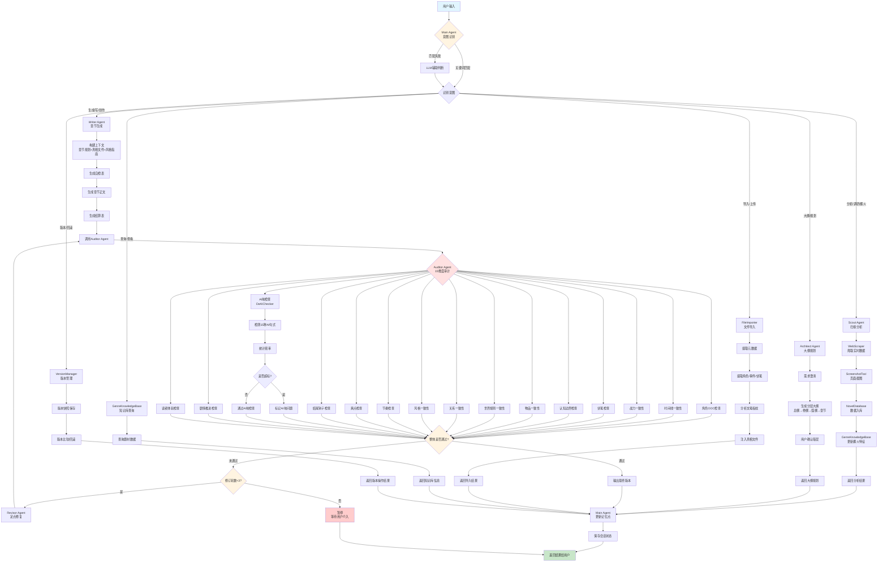

# 网络文学小说创作Agent系统

一个基于多Agent架构的智能网络小说创作系统，通过6个专业化子Agent协同工作，实现从市场分析到章节生成的完整创作流程。

## 目录

- [系统概述](#系统概述)
- [核心特性](#核心特性)
- [系统架构](#系统架构)
- [功能模块详解](#功能模块详解)
- [快速开始](#快速开始)
- [使用指南](#使用指南)
- [配置说明](#配置说明)
- [部署指南](#部署指南)
- [常见问题](#常见问题)
- [维护建议](#维护建议)

---

## 系统概述

### 设计理念

本系统采用"控制面与创作面分离"的多Agent架构，通过Main Agent统一调度6个专业化子Agent，实现网络小说创作的智能化和自动化。

**核心原则：**

- 循序渐进：每个步骤只输出当前阶段内容，不提前暴露后续步骤
- 用户至上：用户可随时修改前面的步骤，系统记忆修改并影响后续步骤
- 主动判断：自动识别用户需求，路由到对应功能
- 质量保证：输出前必须经过Quality Gate检查

### 工作流程

```
用户需求 → 意图识别 → SubAgent路由 → 执行创作 → 质量检查 → 输出结果
```

**7步创作流程：**

1. 扫榜分析（Scout Agent）
2. 大纲规划（Architect Agent）
3. 章节生成（Writer Agent）
4. 连续性审计（Auditor Agent）
5. 修订优化（Revisor Agent）
6. 文风学习（Style Engineer）
7. 批量协调（Batch Coordinator）

---

## 核心特性

### 1. 多Agent协同架构

- **Main Agent**：主协调器，负责意图识别和SubAgent调度
- **Scout Agent**：扫榜分析师，分析爆火小说特征
- **Architect Agent**：架构师，分层大纲规划
- **Writer Agent**：写手，章节正文生成
- **Auditor Agent**：审计员，15维度一致性检查
- **Revisor Agent**：修订员，定点修复问题
- **Style Engineer**：文风工程师，风格学习和适配

### 2. 智能记忆系统

**三层记忆架构：**

- **热记忆**：当前会话上下文（内存）
- **温记忆**：跨会话核心信息（JSON持久化）
- **冷记忆**：历史摘要压缩存储（按章节索引）

**3个记忆点：**

- 记忆点1：用户约束条件（如"不要后宫"、"必须HE"）
- 记忆点2：用户修改记录（用于学习偏好）
- 记忆点3：工作进度（各步骤完成情况）

### 3. 真相文件体系

7个核心事实文件，确保创作一致性：

- 世界状态文件：世界观、规则、设定
- 角色矩阵文件：角色信息、关系、状态
- 时间线文件：事件时间顺序
- 伏笔钩子文件：伏笔埋设、触发、回收
- 物品流转文件：道具、装备流转记录
- 势力关系文件：势力分布、关系变化
- 剧情推进文件：主线、支线进展

### 4. 质量保障机制

**Quality Gate 6维度检查：**

1. 逻辑完整性
2. 信息完整性
3. 用户修改记忆
4. 格式与可读性
5. 专业性与可执行性
6. 一致性检查

**审计员15维度检查：**

- 角色OOC、时间线、战力、伏笔、认知边界
- 物品、世界规则、关系、风格、节奏
- 爽点、结尾钩子、AI味、剧情推进、读者体验

### 5. 多样性控制

- **表达变体库**：常见词汇的多种表达方式
- **梗库**：分类管理流行梗，追踪新鲜度
- **结构模板库**：章节结构、节奏变化模板
- **热点刷新器**：定期更新流行元素

### 6. 版本管理

- 支持断点恢复
- 版本比较和回滚
- 混合版本生成
- 检查点管理

### 7. 实时数据爬取与分析

- **多平台爬虫**：支持番茄小说、起点中文网、七猫小说三大平台
- **智能意图识别**：自动检测用户是否需要爬取数据，无需显式命令
- **数据持久化**：爬取的小说数据自动存入SQLite数据库，支持去重和增量更新
- **可视化截图**：基于Playwright的网页截图功能，记录爬取页面的视觉信息
- **进度反馈**：实时显示任务执行进度，让用户了解Agent在做什么
- **知识库自动更新**：爆火小说的写法特征自动提取并更新到题材知识库

### 8. 进度反馈系统

- **实时状态显示**：每个操作都显示进度条和状态信息
- **颜色编码**：成功（绿色）、失败（红色）、警告（黄色）
- **任务追踪**：记录所有任务的执行历史和耗时
- **用户友好**：清晰的图标和消息，让用户随时了解系统状态

---

## 系统架构

### 目录结构

```
novel_agent/
├── main.py                    # 主程序入口
├── config.py                  # 配置管理
├── requirements.txt           # 依赖列表
├── README.md                  # 项目文档
├── .env.example               # 环境变量示例
├── .gitignore                 # Git忽略规则
├── LICENSE                    # MIT许可证
│
├── agents/                    # 6个专业化子Agent
│   ├── scout.py              # 扫榜分析师
│   ├── architect.py          # 架构师
│   ├── writer.py             # 写手
│   ├── auditor.py            # 审计员
│   ├── revisor.py            # 修订员
│   └── style_engineer.py     # 文风工程师
│
├── core/                      # 核心功能模块（29个）
│   ├── main_agent.py         # 主协调器
│   ├── session_state.py      # 会话状态管理
│   ├── truth_files.py        # 真相文件体系
│   ├── genre_knowledge.py    # 题材知识库
│   ├── memory_system.py      # 三层记忆系统
│   ├── user_profile.py       # 用户画像
│   ├── version_manager.py    # 版本管理
│   ├── file_importer.py      # 文件导入
│   ├── prompt_loader.py      # Prompt模板加载
│   ├── skill_library.py      # Skill存储框架
│   ├── skill_engine.py       # Skill自学习引擎
│   ├── quality_gate.py       # 质量门控
│   ├── foreshadow_tracker.py # 伏笔追踪
│   ├── character_manager.py  # 角色管理
│   ├── modification_tracker.py # 修改追踪
│   ├── checkpoint_manager.py # 检查点管理
│   ├── exporter.py           # 导出功能
│   ├── diagnostic_tool.py    # 诊断工具
│   ├── de_ai_checker.py      # 去AI味检查
│   ├── diversity_report.py   # 多样性报告
│   ├── batch_coordinator.py  # 批量生成协调
│   ├── ambiguity_detector.py # 模糊度检测
│   ├── expression_variants.py # 表达变体库
│   ├── meme_library.py       # 梗库
│   ├── structure_templates.py # 结构模板库
│   ├── trend_refresher.py    # 热点刷新器
│   ├── style_learner.py      # 风格学习器
│   ├── silent_modification_detector.py # 隐性修改检测
│   ├── dialogue_database.py  # 对话数据库
│   └── novel_database.py     # 小说数据库（爬取数据持久化）
│
├── utils/                     # 工具模块
│   ├── llm_client.py         # LLM客户端（多提供商支持）
│   ├── llm_cache.py          # LLM缓存机制
│   ├── web_scraper.py        # 网页爬虫（多平台支持）
│   ├── screenshot_tool.py    # 截图工具（Playwright）
│   └── progress_display.py   # 进度反馈系统
│
├── templates/                 # Prompt模板
│   ├── scout_prompt.md
│   ├── architect_prompt.md
│   ├── writer_prompt.md
│   ├── auditor_prompt.md
│   ├── revisor_prompt.md
│   └── style_engineer_prompt.md
│
├── data/                      # 数据目录
│   ├── genres/               # 题材知识库（15种题材）
│   │   ├── 玄幻.json
│   │   ├── 仙侠.json
│   │   ├── 都市.json
│   │   ├── 历史.json
│   │   ├── 科幻.json
│   │   ├── 游戏.json
│   │   ├── 悬疑.json
│   │   ├── 言情.json
│   │   ├── 现言.json
│   │   ├── 古言.json
│   │   ├── 穿越.json
│   │   ├── 重生.json
│   │   ├── 系统流.json
│   │   ├── 宫斗.json
│   │   └── 宅斗.json
│   ├── truth/                # 真相文件（运行时生成）
│   ├── memory/               # 记忆系统数据
│   ├── skills/               # Skill库
│   ├── versions/             # 版本快照
│   ├── checkpoints/          # 检查点
│   ├── screenshots/          # 网页截图（Playwright生成）
│   └── novels.db             # SQLite数据库（爬取的小说数据）
│
└── tests/                     # 单元测试（348个测试）
    ├── test_main_agent.py
    ├── test_scout.py
    ├── test_architect.py
    ├── test_writer.py
    ├── test_auditor.py
    ├── test_revisor.py
    ├── test_style_engineer.py
    └── ... (其他测试文件)
```

### 组件交互流程

```
┌─────────────┐
│   用户输入   │
└──────┬──────┘
       │
       ▼
┌─────────────────┐
│   Main Agent    │ ← 意图识别 + 流程控制
│  （主协调器）    │
└────────┬────────┘
         │
         ├─→ Scout Agent（扫榜分析）
         │      ↓
         ├─→ Architect Agent（大纲规划）
         │      ↓
         ├─→ Writer Agent（章节生成）
         │      ↓
         ├─→ Auditor Agent（质量审计）
         │      ↓
         ├─→ Revisor Agent（修订优化）
         │      ↓
         └─→ Style Engineer（文风学习）
                ↓
         ┌─────────────┐
         │ Quality Gate│ ← 6维度质量检查
         └──────┬──────┘
                │
                ▼
         ┌─────────────┐
         │   输出结果   │
         └─────────────┘
```

---

## Agent交互逻辑与协作流程

### 核心协作机制

系统采用**主从式多Agent架构**，Main Agent作为中央调度器，根据用户意图动态路由到不同的专业Agent。各Agent之间通过标准化的数据接口进行通信，形成完整的创作流水线。

### Agent调用链路

#### 1. 意图识别与路由（Main Agent）

```
用户输入 → Main Agent
  ↓
意图识别（关键词匹配 + LLM辅助）
  ↓
流程控制检查（防止跳步）
  ↓
路由到对应SubAgent
```

**路由规则：**
- 包含"分析"、"调研"、"爆火"、"热门" → **Scout Agent**（扫榜分析）
- 包含"大纲"、"规划"、"篇章" → **Architect Agent**（大纲规划）
- 包含"生成"、"写"、"创作"、"第X章" → **Writer Agent**（章节生成）
- 包含"导入"、"上传"、"文件" → **FileImporter**（文件导入）
- 包含"查询"、"查看"、"知识库" → **GenreKnowledgeBase**（知识库查询）
- 包含"版本"、"回滚"、"历史" → **VersionManager**（版本管理）

#### 2. 创作流程中的Agent协作

**完整创作链路：**

```
Scout Agent（扫榜分析）
  ↓ 输出：热门小说列表、爆火特征分析
Architect Agent（大纲规划）
  ↓ 输出：总纲、卷纲、弧纲、章节规划
Writer Agent（章节生成）
  ↓ 输出：章节正文、自检表、结算表
Auditor Agent（质量审计）
  ↓ 输出：15维度审计报告
Revisor Agent（修订优化，如未通过）
  ↓ 输出：修订后的章节
Style Engineer（文风学习，可选）
  ↓ 输出：风格指南、文笔指纹
```

#### 3. 关键Agent交互详解

##### Scout Agent → 知识库自动更新

```python
Scout Agent 爬取数据
  ↓
调用 WebScraper 获取实时数据
  ↓
调用 ScreenshotTool 截图保存
  ↓
调用 NovelDatabase 数据入库
  ↓
调用 GenreKnowledgeBase 更新爆火特征
  ↓
返回分析结果给用户
```

**交互逻辑：**
- Scout Agent 优先使用真实爬虫获取数据
- 爬取成功后自动触发知识库更新（`main.py` 中的 `_update_genre_knowledge` 方法）
- 知识库更新流程：爬取数据 → LLM分析提取特征 → 更新JSON文件 → 自动热加载

##### Writer Agent → Auditor Agent → Revisor Agent（质量保障链）

```python
Writer Agent 生成章节
  ↓
调用 Auditor Agent 进行15维度审计
  ↓
审计结果判断：
  ├─ 通过（overall_pass=True）→ 输出最终版本
  └─ 未通过（overall_pass=False）→ 调用 Revisor Agent
      ↓
      Revisor Agent 定点修复
      ↓
      重新调用 Auditor Agent（最多3轮）
      ↓
      3轮后仍未通过 → 暂停，等待用户介入
```

**交互逻辑：**
- Writer Agent 生成章节后，自动调用 Auditor Agent
- Auditor Agent 使用 **DeAIChecker**（去AI味检查器）检测15种AI句式
- 如果检测到AI味超标，Auditor Agent 会标记问题并建议修订
- Revisor Agent 根据审计报告进行定点修复，不全章重写
- 最多进行3轮审计-修订循环，避免无限循环

##### Auditor Agent 的15维度检查

**检查维度清单：**

1. **角色OOC检查** - 检查角色行为是否符合性格设定
2. **时间线一致性** - 检查事件时间顺序是否矛盾
3. **战力/等级一致性** - 检查角色能力是否突变
4. **伏笔检查** - 检查伏笔是否正确埋设/触发/回收
5. **角色认知边界** - 检查角色是否知道不该知道的事
6. **物品/道具一致性** - 检查物品流转是否合理
7. **世界规则一致性** - 检查是否违反已建立的世界规则
8. **关系一致性** - 检查角色关系是否矛盾
9. **风格一致性** - 检查文风是否符合风格指南
10. **节奏检查** - 检查章节节奏是否合理
11. **爽点检查** - 检查爽点分布是否合理
12. **结尾钩子检查** - 检查章节结尾是否有吸引力
13. **AI味检查** - 检查是否包含AI常用句式和表达（集成DeAIChecker）
14. **剧情推进检查** - 检查剧情是否有推进
15. **读者体验检查** - 检查读者阅读体验

**AI味检查机制（DeAIChecker）：**

```python
DeAIChecker 检测15种AI句式：
  - "首先...其次...最后"
  - "值得一提的是"
  - "需要注意的是"
  - "综上所述"
  - "总的来说"
  - "此外"
  - "然而.*但是"
  - "不仅...而且"
  - "一方面.*另一方面"
  - "至关重要"
  - "格局"
  - "织锦"
  - "不可否认"
  - "毋庸置疑"
  - "由此可见"

检测流程：
  接收文本 → 正则表达式匹配 → 统计频率 → 判定是否超标
```

##### Style Engineer（文风工程师）的独立工作流

```python
用户提供参考文本
  ↓
Style Engineer 分析文风
  ↓
提取文笔指纹（句式长度、对话占比、心理描写占比等）
  ↓
生成风格指南（JSON格式）
  ↓
后续 Writer Agent 生成时参考该风格指南
```

**交互逻辑：**
- Style Engineer 可以独立工作，不依赖其他Agent
- 生成的风格指南会被 Writer Agent 在生成章节时引用
- 风格学习遵循"70%保持原有风格 + 30%适应用户偏好"原则

### 记忆点与上下文传递

**3个记忆点机制：**

1. **记忆点1：用户约束**（user_constraints）
   - 记录用户的总体约束条件（如"不要后宫"、"必须HE"）
   - 所有Agent都可以读取这些约束

2. **记忆点2：用户修改**（user_modifications）
   - 记录用户对生成内容的修改
   - 用于学习用户偏好，影响后续生成

3. **记忆点3：工作进度**（work_progress）
   - 记录各步骤的完成情况
   - Main Agent 根据进度控制流程，防止跳步

**上下文传递流程：**

```python
Main Agent 准备上下文
  ↓
包含：
  - intent: 当前意图
  - current_step: 当前工作步骤
  - user_constraints: 用户约束（记忆点1）
  - user_modifications: 用户修改记录（记忆点2）
  - work_progress: 工作进度（记忆点3）
  - conversation_history: 最近10轮对话
  ↓
传递给SubAgent
  ↓
SubAgent基于上下文执行任务
```

### 完整工作流程图



### 关键交互逻辑说明

#### 1. 数据爬取与知识库更新（Scout Agent链路）

**触发条件：**
- 用户输入包含"查看"、"爬取"、"最新"、"热门"、"爆款"、"排行榜"等关键词
- 同时包含平台名称（番茄、起点、七猫）或题材名称（游戏、玄幻、都市等）

**执行流程：**
1. Main Agent 识别爬取意图
2. 调用 Scout Agent
3. Scout Agent 调用 WebScraper 爬取数据
4. 爬取成功后调用 ScreenshotTool 截图
5. 调用 NovelDatabase 数据入库
6. **自动触发知识库更新**（`_update_genre_knowledge` 方法）
   - 构造小说数据摘要（取前5部）
   - 调用 LLM 分析爆火特征
   - 更新对应题材的 `hot_topics` 和 `common_tropes`
   - 更新 `last_updated` 时间戳
7. 返回分析结果

#### 2. 质量保障链（Writer → Auditor → Revisor）

**触发条件：**
- Writer Agent 生成章节后自动触发

**执行流程：**
1. Writer Agent 生成章节正文
2. 自动调用 Auditor Agent 进行15维度审计
3. Auditor Agent 使用 DeAIChecker 检测AI味
4. 如果整体通过（`overall_pass=True`），输出最终版本
5. 如果未通过：
   - 检查修订轮数是否<3
   - 是：调用 Revisor Agent 定点修复，然后重新审计
   - 否：暂停，等待用户介入

**DeAIChecker 检测逻辑：**
- 使用正则表达式匹配15种AI句式
- 统计每种句式的出现次数
- 超过阈值（默认每种最多1次）则标记为问题
- 生成详细的AI味检查报告

#### 3. 文风学习（Style Engineer）

**触发条件：**
- 用户提供参考文本
- 用户主动要求学习某种风格

**执行流程：**
1. Style Engineer 接收参考文本
2. 提取文笔指纹：
   - 句式长度分布（平均、中位数、标准差）
   - 对话占比
   - 心理描写占比
   - 环境描写占比
   - 动作描写占比
   - 常用词汇统计
3. 使用 LLM 分析叙事视角、情感表达风格
4. 生成风格指南（JSON格式）
5. 后续 Writer Agent 生成时参考该风格指南

**风格适配原则：**
- 70% 保持原有风格多样性
- 30% 适应用户偏好

### 常见问题与解决方案

#### Q1: 为什么Scout Agent爬取失败后还能继续分析？

**A:** Scout Agent 采用**优雅降级**策略：
- 优先使用真实爬虫获取数据
- 如果爬虫失败（网络问题、反爬虫策略等），自动降级为 LLM 搜索模式
- LLM 搜索模式会基于训练数据生成热门小说列表
- 虽然不如实时数据准确，但保证流程不中断

#### Q2: Auditor Agent 的15维度检查是并行还是串行？

**A:** **串行检查**，原因：
- 每个维度的检查可能依赖前面的检查结果
- 例如：角色OOC检查需要先加载角色矩阵
- 串行检查便于追踪问题和生成详细报告
- 性能影响较小，因为每个维度的检查时间都很短

#### Q3: 如果Revisor Agent 3轮修订后仍未通过，怎么办？

**A:** 系统会**暂停并等待用户介入**：
- 输出详细的问题摘要
- 列出所有未解决的问题
- 提供修订建议
- 用户可以选择：
  - 手动修改后继续
  - 降低质量标准
  - 重新生成章节
  - 跳过该章节

#### Q4: 知识库自动更新会影响正在进行的创作吗？

**A:** **不会**，原因：
- 知识库采用**热更新机制**
- 每次查询前自动检测文件修改时间
- 文件被修改后自动重新加载，无需重启程序
- 正在进行的创作使用的是内存中的旧版本
- 新创作的内容会使用更新后的知识库

#### Q5: 如何查看Agent之间的交互日志？

**A:** 系统提供**进度反馈系统**（ProgressDisplay）：
- 实时显示每个Agent的执行状态
- 显示任务进度条和耗时
- 颜色编码：成功（绿色）、失败（红色）、警告（黄色）
- 所有任务执行历史都会记录

**示例输出：**
```
● 开始: 正在从番茄小说爬取玄幻类热门小说...
✓ 完成: 正在从番茄小说爬取玄幻类热门小说... (2.3s)
  成功获取10部小说数据
● 开始: 正在截取页面...
✓ 完成: 正在截取页面... (1.5s)
  截图已保存: data/screenshots/fanqie_xuanhuan_20240115_143022.png
● 开始: 正在分析爆火特征并更新知识库...
✓ 完成: 正在分析爆火特征并更新知识库... (3.2s)
  知识库已更新
```

---

## 功能模块详解

### 1. Main Agent（主协调器）

**文件位置：** `core/main_agent.py`

**核心职责：**

- 意图识别：通过关键词匹配和LLM辅助识别用户意图
- 流程控制：基于SessionState控制7步工作流程
- SubAgent调度：根据意图路由到对应的SubAgent
- 记忆管理：维护3个记忆点，确保上下文连续性
- 状态持久化：每次操作后保存状态，支持断点续传

**意图识别：**

```python
INTENT_KEYWORDS = {
    Intent.ANALYZE_TRENDS: ["分析", "调研", "爆火", "热门", "写法", "趋势", "扫榜"],
    Intent.PLAN_OUTLINE: ["大纲", "规划", "篇章", "章节规划", "总纲", "卷纲"],
    Intent.GENERATE_CHAPTER: ["生成", "写", "创作", "第.*章", "正文", "内容"],
    Intent.IMPORT_FILE: ["导入", "上传", "文件", "docx", "pdf", "txt"],
    Intent.QUERY_KNOWLEDGE: ["查询", "查看", "人物", "事件", "伏笔", "知识库"],
    Intent.VERSION_MANAGE: ["版本", "回滚", "历史", "对比", "v1", "v2"],
}
```

### 2. Scout Agent（扫榜分析师）

**文件位置：** `agents/scout.py`

**核心职责：**

- 根据用户提供的小说类型/题材，通过网络搜索获取当前热门作品数据
- 分析3-5部对标作品的爆火特征
- 输出结构化报告 + 针对性写法建议 + 推荐大纲框架

**分析维度：**

1. 开篇钩子：前3章如何吸引读者
2. 爽点分布：爽点如何分布，每隔多少章一个爽点
3. 人设套路：主角和配角的人设特点
4. 剧情模板：使用的经典剧情模板
5. 读者反馈：读者最喜欢什么，最吐槽什么

**输出格式：**

```json
{
    "hot_novels": [热门作品列表],
    "feature_analysis": [特征分析结果],
    "common_features": [共性特征],
    "suggestions": [针对性建议],
    "recommended_outline": [推荐大纲框架]
}
```

### 3. Architect Agent（架构师）

**文件位置：** `agents/architect.py`

**核心职责：**

- 需求澄清：通过结构化提问确认所有关键参数
- 分层大纲生成：总纲层 → 卷纲层 → 弧纲层 → 章节规划
- Compass机制：只详细规划前2卷+当前弧，后续卷保留骨架
- 伏笔规划：每个伏笔必须有埋设章节、触发条件、预计回收章节区间
- 多轮用户确认：每层都需要用户确认
- 局部修改：修改某一层时只重新生成受影响的部分

**Compass滚动规划：**

```
总纲（完整）
  ├─ 卷1（详细规划）
  ├─ 卷2（详细规划）
  ├─ 卷3（骨架）
  └─ 卷4（骨架）
      └─ 完成后自动展开下一卷
```

**伏笔生命周期：**

```
未埋设 → 已埋设 → 积累中 → 已触发 → 已回收
```

### 4. Writer Agent（写手）

**文件位置：** `agents/writer.py`

**核心职责：**

- 根据章节规划 + 真相文件 + 风格指南 + 题材禁忌，生成章节正文
- 内置25条通用写作规则
- 每章生成前输出"自检表"，生成后输出"结算表"

**25条通用写作规则：**

**人物塑造（5条）：**

1. 角色行为必须符合其性格设定，避免OOC
2. 对话要体现角色个性，不同角色说话风格应有区别
3. 角色成长要有渐进性，避免突变
4. 配角要有存在感，不能沦为工具人
5. 反派要有合理动机，不能为恶而恶

**去AI味（5条）：**
6. 避免使用"首先、其次、最后"等机械连接词
7. 避免过度使用"然而、但是"等转折词
8. 避免"值得一提的是、需要注意的是"等AI常用句式
9. 避免过度总结性语句
10. 避免机械化的情感表达

**节奏控制（5条）：**
11. 章节节奏要有变化，不能一直快节奏或慢节奏
12. 爽点分布要合理，不能太密集或太稀疏
13. 每章结尾要有钩子，吸引读者继续阅读
14. 对话和叙述要交替，避免大段独白
15. 场景转换要自然，避免突兀

**视角一致（5条）：**
16. 保持叙事视角一致，不要频繁切换
17. 第三人称视角要保持客观
18. 第一人称视角要保持主观
19. 心理描写要符合视角
20. 信息透露要符合角色认知边界

**其他（5条）：**
21. 环境描写要服务于情节
22. 细节描写要真实可信
23. 避免重复描述
24. 保持文风一致
25. 注意题材禁忌

**输出格式：**

```json
{
    "self_check": {
        "characters": ["本章涉及的角色"],
        "foreshadows": ["本章涉及的伏笔"],
        "excitements": ["本章的爽点设计"]
    },
    "chapter_content": "章节正文",
    "settlement": {
        "new_characters": ["新增角色"],
        "changed_states": ["变更的角色状态"],
        "new_events": ["新增事件"],
        "foreshadow_changes": ["伏笔状态变更"]
    },
    "word_count": 3000
}
```

### 5. Auditor Agent（审计员）

**文件位置：** `agents/auditor.py`

**核心职责：**

- 从15个维度检查章节内容一致性
- 集成Humanizer-zh去AI化检测功能
- 输出审计报告（每个维度PASS/FAIL + 具体问题描述 + 修正方向）

**15个检查维度：**

1. **角色OOC检查**：检查角色行为是否符合性格设定
2. **时间线一致性**：检查事件时间顺序是否矛盾
3. **战力/等级一致性**：检查角色能力是否突变
4. **伏笔检查**：检查伏笔是否正确埋设/触发/回收
5. **角色认知边界**：检查角色是否知道不该知道的事
6. **物品/道具一致性**：检查物品流转是否合理
7. **世界规则一致性**：检查是否违反已建立的世界规则
8. **关系一致性**：检查角色关系是否矛盾
9. **风格一致性**：检查文风是否符合风格指南
10. **节奏检查**：检查章节节奏是否合理
11. **爽点检查**：检查爽点分布是否合理
12. **结尾钩子检查**：检查章节结尾是否有吸引力
13. **AI味检查**：检查是否包含AI常用句式和表达
14. **剧情推进检查**：检查剧情是否有推进
15. **读者体验检查**：检查读者阅读体验

**AI味禁用清单（15种）：**

- "首先...其次...最后"
- "值得一提的是"
- "需要注意的是"
- "综上所述"
- "总的来说"
- "然而"（过度使用）
- "但是"（过度使用）
- "因此"（过度使用）
- "所以"（过度使用）
- "显然"
- "毫无疑问"
- "不言而喻"
- "众所周知"
- "由此可见"
- "一方面...另一方面"

**输出格式：**

```json
{
    "audit_results": [
        {
            "dimension": "角色OOC检查",
            "pass": true,
            "issues": [],
            "suggestions": []
        },
        {
            "dimension": "AI味检查",
            "pass": false,
            "issues": ["检测到3处AI常用句式"],
            "suggestions": ["替换'首先...其次...最后'为更自然的表达"]
        }
    ],
    "overall_pass": false,
    "issues": ["问题列表"],
    "suggestions": ["修正建议"]
}
```

### 6. Revisor Agent（修订员）

**文件位置：** `agents/revisor.py`

**核心职责：**

- 根据审计报告进行定点修复
- 只修改有问题的段落，不全章重写
- 实现最多3轮审计-修订循环
- 3轮后仍不通过则暂停，输出问题摘要等待用户介入

**修订流程：**

```
审计报告 → 定位问题段落 → 定点修复 → 重新审计
    ↓                                    ↓
  通过？ ──是──→ 输出修订版本
    ↓
   否（最多3轮）
    ↓
  暂停，等待用户介入
```

### 7. Style Engineer（文风工程师）

**文件位置：** `agents/style_engineer.py`

**核心职责：**

- 分析参考文本的写作风格
- 提取文笔指纹（句式长度分布、对话占比、心理描写占比、常用词汇等）
- 生成风格指南文件（JSON格式，包含"必须做"和"禁止做"清单）
- 实现"轻微改动"原则：70%保持原有风格，30%适应用户偏好

**文笔指纹：**

```json
{
    "sentence_length_distribution": {
        "short": 0.3,
        "medium": 0.5,
        "long": 0.2
    },
    "dialogue_ratio": 0.4,
    "psychological_description_ratio": 0.2,
    "environment_description_ratio": 0.15,
    "action_description_ratio": 0.25,
    "common_vocabulary": ["词汇列表"],
    "narrative_perspective": "third_person",
    "writing_style_tags": ["标签列表"]
}
```

### 8. 核心支撑模块

#### 8.1 真相文件体系（TruthFiles）

**文件位置：** `core/truth_files.py`

**7个核心事实文件：**

1. `world_state.json`：世界状态（世界观、规则、设定）
2. `character_matrix.json`：角色矩阵（角色信息、关系、状态）
3. `timeline.json`：时间线（事件时间顺序）
4. `foreshadow_hooks.json`：伏笔钩子（伏笔埋设、触发、回收）
5. `item_flow.json`：物品流转（道具、装备流转记录）
6. `faction_relations.json`：势力关系（势力分布、关系变化）
7. `plot_progress.json`：剧情推进（主线、支线进展）

**交叉验证：**

- 角色行为 vs 角色矩阵
- 事件时间 vs 时间线
- 伏笔状态 vs 伏笔钩子
- 物品使用 vs 物品流转

#### 8.2 题材知识库（GenreKnowledgeBase）

**文件位置：** `core/genre_knowledge.py`

**支持15种题材：**

- 玄幻、仙侠、都市、历史、科幻
- 游戏、悬疑、言情、现言、古言
- 穿越、重生、系统流、宫斗、宅斗

**每个题材包含：**

- 核心元素
- 常见套路
- 读者期待
- 写作风格
- 禁忌清单
- 热门梗

**知识库自动更新机制：**

系统会在以下场景自动更新知识库：

1. **爬取热门小说后**（自动触发）
   - 从爬取的小说数据中提取写法特征
   - 分析爆火元素的共性模式
   - 更新对应题材的 `hot_topics`（热点话题）和 `common_tropes`（常见套路）
   - 更新 `last_updated` 时间戳

2. **分析完成后**
   - 从分析结果中提取新的写作技巧
   - 识别读者反馈中的高频评价
   - 更新 `hot_topics` 字段

**更新流程：**
```
爬取数据 → LLM分析提取特征 → 更新知识库JSON文件 → 自动热加载
```

**实际更新逻辑（在 main.py 中）：**
```python
# 获取现有题材数据
existing = self.genre_kb.get_genre(genre)
if existing:
    # 更新热点信息和常见套路
    existing["hot_topics"] = features.get("hot_writing_features", [])
    existing["common_tropes"] = features.get("popular_tropes", existing.get("common_tropes", []))
    existing["last_updated"] = str(datetime.now())
    self.genre_kb.update_genre(genre, existing)
else:
    # 创建新题材（包含完整字段）
    new_genre = {
        "name": genre,
        "tags": list(set(tag for n in novels for tag in n.get("tags", []))),
        "writing_style": features.get("hot_writing_features", [""]),
        "plot_systems": features.get("popular_tropes", []),
        "character_templates": features.get("character_archetypes", []),
        "common_tropes": features.get("popular_tropes", []),
        "hot_topics": features.get("hot_writing_features", []),
        "last_updated": str(datetime.now())
    }
    self.genre_kb.add_genre(genre, new_genre)
```

**手动更新知识库：**
```python
from core.genre_knowledge import get_genre_knowledge_base

kb = get_genre_knowledge_base()

# 更新现有题材
genre_data = kb.get_genre("玄幻")
if genre_data:
    genre_data["hot_topics"] = ["新的热点1", "新的热点2"]
    genre_data["last_updated"] = "2024-01-15T10:30:00"
    kb.update_genre("玄幻", genre_data)

# 添加新题材
new_genre = {
    "name": "新题材",
    "tags": ["标签1", "标签2"],
    "writing_style": "写作风格描述",
    "hot_topics": ["热点1", "热点2"],
    "last_updated": "2024-01-15T10:30:00"
}
kb.add_genre("新题材", new_genre)

# 强制重新加载所有题材文件
kb.reload()
```

**热更新机制：**
- 每次查询前自动检测文件修改时间
- 文件被修改后自动重新加载，无需重启程序
- 支持增量更新：只重新加载变化的文件

#### 8.3 三层记忆系统（MemorySystem）

**文件位置：** `core/memory_system.py`

**热记忆（Hot Memory）：**

- 当前会话上下文
- 存储在内存中
- 会话结束后转入温记忆

**温记忆（Warm Memory）：**

- 跨会话的核心信息
- 持久化到 `data/memory/warm_memory.json`
- 包含：用户画像、知识库索引、Skill索引

**冷记忆（Cold Memory）：**

- 历史摘要压缩存储
- 按章节索引
- 持久化到 `data/memory/cold_memory/`

#### 8.4 质量门控（QualityGate）

**文件位置：** `core/quality_gate.py`

**6维度检查：**

1. 逻辑完整性
2. 信息完整性
3. 用户修改记忆
4. 格式与可读性
5. 专业性与可执行性
6. 一致性检查

**PASS/FAIL判定：**

- 所有维度通过 → PASS
- 任一维度失败 → FAIL，返回上一步重新规划

#### 8.5 伏笔追踪系统（ForeshadowTracker）

**文件位置：** `core/foreshadow_tracker.py`

**伏笔生命周期：**

```
未埋设 → 已埋设 → 积累中 → 已触发 → 已回收 → 已放弃
```

**健康度检查：**

- 活跃伏笔不超过10个
- 超过预计回收章节5章仍未触发 → 警告
- 埋设后超过5章未提及 → 警告

#### 8.6 角色管理系统（CharacterManager）

**文件位置：** `core/character_manager.py`

**角色状态快照：**

```json
{
    "character_id": "主角ID",
    "basic_info": {
        "name": "角色名",
        "age": 20,
        "gender": "男"
    },
    "personality": ["性格特点"],
    "current_state": {
        "location": "当前位置",
        "status": "当前状态",
        "abilities": ["能力列表"]
    },
    "relationships": {
        "角色B": "关系描述"
    },
    "knowledge_boundary": ["知道的信息"],
    "growth_line": ["成长轨迹"]
}
```

**一致性检查：**

- 行为符合性格
- 对话符合风格
- 能力不突变
- 认知边界不越界

#### 8.7 版本管理系统（VersionManager）

**文件位置：** `core/version_manager.py`

**功能：**

- 版本快照保存
- 版本比较
- 版本回滚
- 混合版本生成

#### 8.8 批量生成协调器（BatchCoordinator）

**文件位置：** `core/batch_coordinator.py`

**功能：**

- 逐章生成 → 审计 → 更新真相文件 → 下一章
- 跨章一致性检查
- 单章失败时只重写该章

#### 8.9 表达变体库（ExpressionVariants）

**文件位置：** `core/expression_variants.py`

**功能：**

- 常见词汇的多种表达方式
- 重复检测：统计最近10章的词汇使用频率
- 建议替换：检测到重复时提供替代方案

#### 8.10 梗库（MemeLibrary）

**文件位置：** `core/meme_library.py`

**功能：**

- 分类管理流行梗（打脸梗、升级梗、感情梗等）
- 新鲜度追踪：记录使用时间和章节
- 组合创新：梗的组合使用

#### 8.11 结构模板库（StructureTemplates）

**文件位置：** `core/structure_templates.py`

**功能：**

- 章节结构模板（正叙型、倒叙型、多线型等）
- 结尾钩子模板（悬念型、反转型、情感型等）
- 节奏变化规则

#### 8.12 热点刷新器（TrendRefresher）

**文件位置：** `core/trend_refresher.py`

**触发条件：**

- 每生成10-25章
- 进入新篇章/新卷
- 用户主动要求
- 检测到梗/词汇超过20章未更新

**功能：**

- 搜索当前热门内容
- 更新梗库和表达变体库
- 生成"热点更新报告"

#### 8.13 风格学习器（StyleLearner）

**文件位置：** `core/style_learner.py`

**3个学习渠道：**

1. 用户上传的参考文本
2. 用户对生成内容的修改
3. 用户的对话风格

**"轻微改动"原则：**

- 70%保持原有风格多样性
- 30%适应用户偏好

**学习报告：**

- 每10章输出一次风格学习报告

#### 8.14 隐性修改检测器（SilentModificationDetector）

**文件位置：** `core/silent_modification_detector.py`

**4种检测手段：**

1. 文件变更检测（修改时间对比）
2. 对话中的修改意图检测（关键词/模式匹配）
3. 生成前一致性检查（真相文件 vs 实际内容）
4. 用户主动同步命令

**检测到异常时：**

- 主动确认
- 提供[A][B][C]选项

#### 8.15 模糊度检测器（AmbiguityDetector）

**文件位置：** `core/ambiguity_detector.py`

**4种检测规则：**

1. 信息不完整（缺少关键参数）
2. 信息有歧义（多种理解）
3. 信息与之前矛盾
4. 信息太模糊

**提问格式：**

```
[A] 选项1
[B] 选项2
[C] 选项3
[D] 其他
```

#### 8.16 去AI味检查器（DeAIChecker）

**文件位置：** `core/de_ai_checker.py`

**功能：**

- 维护"AI味禁用清单"（15种常见AI句式）
- 审计时自动统计
- 超标则不通过

#### 8.17 多样性统计报告（DiversityReport）

**文件位置：** `core/diversity_report.py`

**统计内容：**

- 词汇使用频率
- 句式分布
- 梗使用分布
- 结构分布

**功能：**

- 定期输出报告
- 提醒"过度使用"的元素

#### 8.18 文件导入模块（FileImporter）

**文件位置：** `core/file_importer.py`

**支持格式：**

- .docx（Word文档）
- .pdf（PDF文档）
- .txt（纯文本）
- .md（Markdown）

**功能：**

- 提取元数据
- 提取角色信息
- 提取事件
- 提取伏笔
- 分析文笔指纹
- 自动注入真相文件体系

#### 8.19 导出功能（Exporter）

**文件位置：** `core/exporter.py`

**支持格式：**

- TXT（每章一个文件）
- Markdown（带格式）
- EPUB（电子书）

**功能：**

- 自动过滤内部工件（自检表、结算表、审计报告等）

#### 8.20 诊断工具（DiagnosticTool）

**文件位置：** `core/diagnostic_tool.py`

**功能：**

- 生成系统状态报告
- 健康检查
- 导出诊断报告

#### 8.21 Skill存储框架（SkillLibrary）

**文件位置：** `core/skill_library.py`

**Skill数据结构：**

```json
{
    "skill_id": "技能ID",
    "name": "技能名称",
    "trigger": "触发条件",
    "steps": ["执行步骤"],
    "success_rate": 0.85,
    "user_feedback": ["用户反馈"],
    "last_used": "最后使用时间",
    "version": "版本号"
}
```

#### 8.22 Skill自学习引擎（SkillEngine）

**文件位置：** `core/skill_engine.py`

**功能：**

- 自动创建Skill（完成复杂任务后封装为可复用Skill）
- 使用中自改进（记录效果反馈，连续不满意则自动调整）
- Skill检索（新任务开始时自动检索匹配的Skill）

#### 8.23 用户画像（UserProfile）

**文件位置：** `core/user_profile.py`

**属性：**

- preferences：偏好
- writing_habits：写作习惯
- modification_history：修改历史
- satisfaction_log：满意度记录

#### 8.24 会话状态管理（SessionState）

**文件位置：** `core/session_state.py`

**功能：**

- 持久化到 `data/session_state.json`
- 记录当前工作进度
- 记录用户约束
- 记录修改方案

#### 8.25 检查点管理（CheckpointManager）

**文件位置：** `core/checkpoint_manager.py`

**功能：**

- 自动checkpoint（关键步骤完成后自动保存）
- 手动checkpoint（用户主动保存）
- 从checkpoint恢复

#### 8.26 修改追踪（ModificationTracker）

**文件位置：** `core/modification_tracker.py`

**功能：**

- 记录修改内容
- 评估影响范围
- 支持部分回滚

#### 8.27 对话数据库（DialogueDatabase）

**文件位置：** `core/dialogue_database.py`

**功能：**

- 记录对话历史
- 分析对话模式
- 提供对话建议

#### 8.28 Prompt模板加载器（PromptLoader）

**文件位置：** `core/prompt_loader.py`

**功能：**

- 加载6个SubAgent的Prompt模板
- 动态填充参数
- 支持模板继承

---

## 快速开始

### 环境要求

- Python 3.8+
- pip 包管理器
- LLM API密钥（支持Kimi/DeepSeek/GLM/OpenAI/Claude）

### 安装步骤

#### 1. 克隆项目

```bash
git clone <repository-url>
cd novel_agent
```

#### 2. 创建虚拟环境（推荐）

```bash
python -m venv .venv
source .venv/bin/activate  # Linux/Mac
.venv\Scripts\activate     # Windows
```

#### 3. 安装依赖

```bash
pip install -r requirements.txt
```

**主要依赖：**

- `openai`：OpenAI兼容API客户端
- `anthropic`：Claude API客户端
- `python-docx`：Word文档处理
- `pdfplumber`：PDF文档处理
- `ebooklib`：EPUB电子书生成
- `bm25s`：文本检索
- `jieba`：中文分词
- `requests`：HTTP请求（爬虫模块）
- `beautifulsoup4`：HTML解析（爬虫模块）

**可选依赖（截图功能）：**

- `playwright`：浏览器自动化工具（用于网页截图）

**安装 Playwright（如需截图功能）：**

```bash
# 安装 playwright 库
pip install playwright

# 安装浏览器（必须执行，会下载 Chromium 等浏览器）
playwright install chromium
```

**注意：**

- Playwright 仅用于截图功能，不影响核心功能
- 未安装 Playwright 时，系统会优雅降级，跳过截图步骤
- 首次运行 `playwright install` 需要下载浏览器，可能需要几分钟

#### 4. 配置API密钥

**方式一：使用环境变量（推荐）**

复制环境变量示例文件：

```bash
cp .env.example .env
```

编辑 `.env` 文件：

```bash
# DeepSeek配置示例
LLM_PROVIDER=deepseek
LLM_MODEL=deepseek-chat
LLM_API_KEY=your-api-key-here
LLM_BASE_URL=https://api.deepseek.com/v1
LLM_TEMPERATURE=0.7
LLM_MAX_TOKENS=8192
```

**方式二：直接修改config.py**

编辑 `config.py`：

```python
LLM_PROVIDER = "deepseek"
LLM_MODEL = "deepseek-chat"
LLM_API_KEY = "your-api-key-here"
LLM_BASE_URL = "https://api.deepseek.com/v1"
LLM_TEMPERATURE = 0.7
LLM_MAX_TOKENS = 8192
```

**支持的LLM提供商：**

| 提供商   | LLM_PROVIDER | LLM_MODEL                  | LLM_BASE_URL                         |
| -------- | ------------ | -------------------------- | ------------------------------------ |
| Kimi     | kimi         | kimi-k2.5                  | https://api.moonshot.cn/v1           |
| DeepSeek | deepseek     | deepseek-chat              | https://api.deepseek.com/v1          |
| 智谱GLM  | glm          | glm-4                      | https://open.bigmodel.cn/api/paas/v4 |
| OpenAI   | openai       | gpt-4                      | https://api.openai.com/v1            |
| Claude   | claude       | claude-3-5-sonnet-20241022 | （无需base_url）                     |

#### 5. 运行测试

```bash
python -m unittest discover -s tests -p "test_*.py"
```

应看到：

```
Ran 348 tests in X.XXXs
OK
```

#### 6. 启动系统

```bash
python main.py
```

看到以下输出表示启动成功：

```
小说创作Agent系统
连接AI服务...
连接成功
初始化爬虫模块...
初始化截图模块...
初始化数据库...

功能：1.分析爆火小说 2.规划大纲 3.生成章节 4.导入文件 5.爬取平台数据
命令：help-帮助 quit-退出 status-状态 crawl-爬取
>
```

---

## 使用指南

### 基本命令

```bash
help / h / 帮助 / ?    # 显示帮助信息
quit / exit / q / 退出  # 退出系统
status / 状态           # 显示当前状态
test / 测试             # 测试API连接
```

### 创作流程

#### 步骤1：扫榜分析

**输入示例：**

```
> 我想写一本玄幻小说，帮我分析一下当前爆火的玄幻小说
```

**系统响应：**

1. Scout Agent搜索当前热门玄幻小说
2. 分析3-5部对标作品的爆火特征
3. 输出结构化报告：
   - 热门作品列表
   - 特征分析（开篇钩子、爽点分布、人设套路等）
   - 共性特征
   - 针对性建议
   - 推荐大纲框架

#### 步骤2：大纲规划

**输入示例：**

```
> 根据刚才的分析，帮我规划一个玄幻大纲
```

**系统响应：**

1. Architect Agent进行需求澄清（如有缺失参数）
2. 生成分层大纲：
   - 总纲（整体剧情走向）
   - 卷纲（分卷设计）
   - 弧纲（剧情弧设计）
   - 章节规划（每章内容）
   - 伏笔规划（伏笔埋设、触发、回收）
3. 每层都需要用户确认

**Compass滚动规划：**

- 只详细规划前2卷+当前弧
- 后续卷保留骨架
- 每完成一卷自动展开下一卷

#### 步骤3：章节生成

**输入示例：**

```
> 开始生成第1章
```

**系统响应：**

1. Writer Agent生成自检表（本章涉及的角色、伏笔、爽点）
2. 用户确认自检表
3. 生成章节正文
4. 生成结算表（新增/变更的角色状态、事件、伏笔）
5. 交给Auditor Agent审计

#### 步骤4：质量审计

**系统自动执行：**

1. Auditor Agent从15个维度检查章节
2. 生成审计报告
3. 如有问题，交给Revisor Agent修订
4. 最多3轮审计-修订循环
5. 3轮后仍不通过则暂停，等待用户介入

#### 步骤5：批量生成

**输入示例：**

```
> 批量生成第1-10章
```

**系统响应：**

1. Batch Coordinator逐章生成
2. 每章生成后自动审计
3. 更新真相文件
4. 跨章一致性检查
5. 单章失败时只重写该章

### 高级功能

#### 导入已有小说

**输入示例：**

```
> 导入文件 path/to/novel.docx
```

**系统响应：**

1. FileImporter提取元数据、角色、事件、伏笔
2. 分析文笔指纹
3. 自动注入真相文件体系
4. 可以继续创作或分析

#### 版本管理

**输入示例：**

```
> 查看版本历史
> 回滚到版本v2
> 对比版本v1和v2
```

**系统响应：**

1. VersionManager提供版本管理功能
2. 支持版本比较、回滚、混合版本生成

#### 风格学习

**输入示例：**

```
> 学习这个参考文本的风格 path/to/reference.txt
> 查看风格学习报告
```

**系统响应：**

1. StyleLearner分析参考文本
2. 提取文笔指纹
3. 生成风格指南
4. 后续生成会适配该风格

#### 查询知识库

**输入示例：**

```
> 查看当前角色列表
> 查看伏笔状态
> 查看时间线
```

**系统响应：**

1. 从真相文件体系查询信息
2. 返回结构化数据

#### 导出小说

**输入示例：**

```
> 导出为TXT
> 导出为Markdown
> 导出为EPUB
```

**系统响应：**

1. Exporter过滤内部工件
2. 生成指定格式文件
3. 保存到输出目录

#### 爬取热门小说（新功能）

**输入示例：**

```
> 查看番茄小说的玄幻类热门作品
> 分析起点中文网的都市类爆款小说
> 爬取七猫小说的仙侠类排行榜
```

**系统响应：**

1. 自动识别平台和题材
2. 显示实时进度：
   ```
   ● 开始: 正在从番茄小说爬取玄幻类热门小说...
   ✓ 完成: 正在从番茄小说爬取玄幻类热门小说... (2.3s)
     成功获取10部小说数据
   ● 开始: 正在截取页面...
   ✓ 完成: 正在截取页面... (1.5s)
     截图已保存: data/screenshots/fanqie_xuanhuan_20240115_143022.png
   ● 开始: 正在分析爆火特征并更新知识库...
   ✓ 完成: 正在分析爆火特征并更新知识库... (3.2s)
     知识库已更新
   ```
3. 数据自动入库（SQLite数据库）
4. 截图保存到 `data/screenshots/`
5. 知识库自动更新爆火特征
6. 生成分析报告

**支持的平台：**

- 番茄小说（fanqie）
- 起点中文网（qidian）
- 七猫小说（qimao）

**支持的题材：**

- 都市、玄幻、仙侠、科幻、游戏、悬疑

**截图功能说明：**

- 需要安装 Playwright：`pip install playwright && playwright install chromium`
- 未安装 Playwright 时，系统会跳过截图步骤，不影响其他功能
- 截图文件命名格式：`{平台}_{题材}_{日期}_{时间}.png`
- 截图保存位置：`data/screenshots/`

#### 显式爬取命令

**输入示例：**

```
> crawl 番茄 玄幻
> crawl 起点 都市
> screenshot https://fanqienovel.com
```

**系统响应：**

- `crawl` 命令：直接爬取指定平台和题材
- `screenshot` 命令：对指定URL进行截图

---

## 配置说明

### 核心配置文件

**config.py** 包含所有可调参数：

#### LLM配置

```python
# 支持的提供商: kimi, deepseek, glm, openai, claude, custom
LLM_PROVIDER = "deepseek"
LLM_MODEL = "deepseek-chat"
LLM_API_KEY = "your-api-key-here"
LLM_BASE_URL = "https://api.deepseek.com/v1"
LLM_TEMPERATURE = 0.7  # 温度参数（0.0-2.0）
LLM_MAX_TOKENS = 8192  # 最大输出token数
```

**注意：** 不同模型有不同的参数限制

- kimi-k2.5: temperature只支持1.0，max_tokens最大131077
- deepseek-chat: max_tokens最大65536
- glm-4: max_tokens最大4096

#### 质量检查阈值

```python
# 审计-修订最大轮数
MAX_AUDIT_ROUNDS = 3

# 活跃伏笔上限
MAX_ACTIVE_FORESHADOWS = 10

# 伏笔陈旧阈值（章）
FORESHADOW_STALE_THRESHOLD = 5

# 伏笔超期阈值（章）
FORESHADOW_OVERDUE_THRESHOLD = 5

# AI句式频率上限（每章）
AI_TIC_MAX_PER_CHAPTER = 1
```

#### 多样性控制

```python
# 多样性统计窗口（章）
VARIETY_WINDOW_SIZE = 10

# 表达重复阈值
EXPRESSION_REPEAT_THRESHOLD = 5

# 梗陈旧阈值（章）
MEME_STALE_THRESHOLD = 50

# 热点刷新最小间隔（章）
TREND_REFRESH_MIN_INTERVAL = 5

# 热点刷新最大间隔（章）
TREND_REFRESH_MAX_INTERVAL = 25
```

#### 风格学习

```python
# 多样性保持比例（60%保持原有风格）
STYLE_LEARN_DIVERSITY_RATIO = 0.6

# 用户适应比例（40%适应用户偏好）
STYLE_LEARN_ADAPT_RATIO = 0.4

# 学习报告间隔（章）
STYLE_LEARN_REPORT_INTERVAL = 10
```

#### 批量生成

```python
# 单次批量生成最大章数
BATCH_MAX_CHAPTERS = 10
```

#### 章节字数控制

```python
# 章节最小字数
CHAPTER_MIN_WORDS = 2000

# 章节最大字数
CHAPTER_MAX_WORDS = 5000
```

#### 文件导入

```python
# 支持的文件格式
SUPPORTED_FILE_FORMATS = [".docx", ".pdf", ".txt", ".md"]
```

#### 多样性报告

```python
# 词汇过度使用阈值
DIVERSITY_WORD_THRESHOLD = 10

# 梗过度使用阈值
DIVERSITY_MEME_THRESHOLD = 5
```

### 目录结构配置

```python
# 项目根目录
PROJECT_ROOT = os.path.dirname(os.path.abspath(__file__))

# 数据目录
DATA_DIR = os.path.join(PROJECT_ROOT, "data")

# 题材知识库目录
GENRES_DIR = os.path.join(DATA_DIR, "genres")

# 真相文件目录
TRUTH_DIR = os.path.join(DATA_DIR, "truth")

# Skill库目录
SKILLS_DIR = os.path.join(DATA_DIR, "skills")

# 记忆系统目录
MEMORY_DIR = os.path.join(DATA_DIR, "memory")

# 冷记忆目录
COLD_MEMORY_DIR = os.path.join(MEMORY_DIR, "cold_memory")

# 版本管理目录
VERSIONS_DIR = os.path.join(DATA_DIR, "versions")

# 检查点目录
CHECKPOINTS_DIR = os.path.join(DATA_DIR, "checkpoints")

# Prompt模板目录
TEMPLATES_DIR = os.path.join(PROJECT_ROOT, "templates")
```

### 会话状态配置

```python
# 会话状态文件
SESSION_STATE_FILE = os.path.join(DATA_DIR, "session_state.json")

# 用户画像文件
USER_PROFILE_FILE = os.path.join(MEMORY_DIR, "user_profile.json")

# 温记忆文件
WARM_MEMORY_FILE = os.path.join(MEMORY_DIR, "warm_memory.json")
```

---

## 部署指南

### 本地开发环境

#### 1. 环境准备

**Python安装：**

- 下载Python 3.8+：https://www.python.org/downloads/
- 安装时勾选"Add Python to PATH"

**Git安装：**

- 下载Git：https://git-scm.com/downloads
- 安装后配置用户名和邮箱：

```bash
git config --global user.name "Your Name"
git config --global user.email "your.email@example.com"
```

#### 2. 项目克隆

```bash
git clone <repository-url>
cd novel_agent
```

#### 3. 虚拟环境

**创建虚拟环境：**

```bash
python -m venv .venv
```

**激活虚拟环境：**

```bash
# Windows
.venv\Scripts\activate

# Linux/Mac
source .venv/bin/activate
```

**退出虚拟环境：**

```bash
deactivate
```

#### 4. 依赖安装

```bash
pip install -r requirements.txt
```

**依赖说明：**

```txt
openai>=1.0.0          # OpenAI兼容API客户端
anthropic>=0.8.0       # Claude API客户端
python-docx>=0.8.11    # Word文档处理
pdfplumber>=0.7.0      # PDF文档处理
ebooklib>=0.17         # EPUB电子书生成
bm25s>=0.1.0           # 文本检索
jieba>=0.42.1          # 中文分词
```

#### 5. 配置API密钥

**方式一：环境变量（推荐）**

创建 `.env` 文件：

```bash
cp .env.example .env
```

编辑 `.env`：

```bash
LLM_PROVIDER=deepseek
LLM_MODEL=deepseek-chat
LLM_API_KEY=your-api-key-here
LLM_BASE_URL=https://api.deepseek.com/v1
LLM_TEMPERATURE=0.7
LLM_MAX_TOKENS=8192
```

**方式二：直接修改config.py**

编辑 `config.py`：

```python
LLM_PROVIDER = "deepseek"
LLM_MODEL = "deepseek-chat"
LLM_API_KEY = "your-api-key-here"
LLM_BASE_URL = "https://api.deepseek.com/v1"
```

#### 6. 运行测试

```bash
python -m unittest discover -s tests -p "test_*.py"
```

应看到：

```
Ran 348 tests in X.XXXs
OK
```

#### 7. 启动系统

```bash
python main.py
```

### 生产环境部署

#### 1. 服务器要求

**最低配置：**

- CPU: 2核
- 内存: 4GB
- 硬盘: 20GB
- 网络: 稳定的互联网连接（用于调用LLM API）

**推荐配置：**

- CPU: 4核+
- 内存: 8GB+
- 硬盘: 50GB+
- 网络: 稳定的互联网连接

#### 2. 系统要求

- Ubuntu 20.04+ / CentOS 7+ / Windows Server 2019+
- Python 3.8+
- Git

#### 3. 部署步骤

**步骤1：安装系统依赖**

```bash
# Ubuntu/Debian
sudo apt update
sudo apt install python3 python3-pip python3-venv git

# CentOS/RHEL
sudo yum install python3 python3-pip git
```

**步骤2：克隆项目**

```bash
cd /opt
sudo git clone <repository-url> novel_agent
cd novel_agent
```

**步骤3：创建虚拟环境**

```bash
sudo python3 -m venv .venv
source .venv/bin/activate
```

**步骤4：安装依赖**

```bash
pip install -r requirements.txt
```

**步骤5：配置API密钥**

```bash
cp .env.example .env
nano .env
```

编辑 `.env` 文件，填入API密钥。

**步骤6：运行测试**

```bash
python -m unittest discover -s tests -p "test_*.py"
```

**步骤7：创建系统服务（可选）**

创建 `/etc/systemd/system/novel-agent.service`：

```ini
[Unit]
Description=Novel Agent Service
After=network.target

[Service]
Type=simple
User=www-data
WorkingDirectory=/opt/novel_agent
Environment="PATH=/opt/novel_agent/.venv/bin"
ExecStart=/opt/novel_agent/.venv/bin/python main.py
Restart=always

[Install]
WantedBy=multi-user.target
```

启动服务：

```bash
sudo systemctl daemon-reload
sudo systemctl enable novel-agent
sudo systemctl start novel-agent
sudo systemctl status novel-agent
```

#### 4. 数据备份

**定期备份以下目录：**

- `data/truth/`：真相文件
- `data/memory/`：记忆系统数据
- `data/skills/`：Skill库
- `data/versions/`：版本快照
- `data/checkpoints/`：检查点
- `data/screenshots/`：网页截图（可选）
- `data/novels.db`：爬取的小说数据库

**备份脚本示例：**

```bash
#!/bin/bash
BACKUP_DIR="/backup/novel_agent"
DATE=$(date +%Y%m%d_%H%M%S)
mkdir -p $BACKUP_DIR/$DATE

cp -r /opt/novel_agent/data/truth $BACKUP_DIR/$DATE/
cp -r /opt/novel_agent/data/memory $BACKUP_DIR/$DATE/
cp -r /opt/novel_agent/data/skills $BACKUP_DIR/$DATE/
cp -r /opt/novel_agent/data/versions $BACKUP_DIR/$DATE/
cp -r /opt/novel_agent/data/checkpoints $BACKUP_DIR/$DATE/
cp -r /opt/novel_agent/data/screenshots $BACKUP_DIR/$DATE/ 2>/dev/null || true
cp /opt/novel_agent/data/novels.db $BACKUP_DIR/$DATE/ 2>/dev/null || true

# 保留最近30天的备份
find $BACKUP_DIR -type d -mtime +30 -exec rm -rf {} \;
```

**设置定时任务：**

```bash
crontab -e
```

添加：

```
0 2 * * * /path/to/backup.sh
```

---

## 常见问题

### 1. API连接失败

**问题：**

```
连接测试失败: Error code: 400 - Invalid API key
```

**解决方案：**

1. 检查API密钥是否正确
2. 检查 `.env` 文件是否存在
3. 检查 `config.py` 中的配置
4. 运行 `test` 命令测试连接

### 2. max_tokens超限

**问题：**

```
Invalid max_tokens value, the valid range is [1, 393216]
```

**解决方案：**

1. 修改 `config.py` 中的 `LLM_MAX_TOKENS`
2. 不同模型有不同的限制：

   - kimi-k2.5: 最大131077
   - deepseek-chat: 最大65536

### 3. 依赖安装失败

**问题：**

```
ERROR: Failed building wheel for xxx
```

**解决方案：**

1. 升级pip：

```bash
python -m pip install --upgrade pip
```

2. 安装编译工具（Linux）：

```bash
sudo apt install build-essential python3-dev
```

3. 使用预编译包：

```bash
pip install --only-binary :all: -r requirements.txt
```

### 4. 测试失败

**问题：**

```
FAILED (errors=5)
```

**解决方案：**

1. 检查Python版本（需要3.8+）
2. 检查依赖是否完整安装
3. 检查API密钥是否配置
4. 查看详细错误信息：

```bash
python -m unittest discover -s tests -p "test_*.py" -v
```

### 5. 内存不足

**问题：**

```
MemoryError
```

**解决方案：**

1. 减少批量生成章数：

```python
BATCH_MAX_CHAPTERS = 5  # 从10改为5
```

2. 减少缓存大小：

```python
# 在 utils/llm_cache.py 中
self.max_size = 500  # 从1000改为500
```

3. 定期清理冷记忆：

```bash
# 删除30天前的冷记忆
find data/memory/cold_memory -type f -mtime +30 -delete
```

### 6. 文件导入失败

**问题：**

```
不支持的文件格式
```

**解决方案：**

1. 检查文件格式是否在支持列表中：

   - .docx
   - .pdf
   - .txt
   - .md
2. 检查文件是否损坏
3. 检查文件路径是否正确

### 7. 章节生成质量差

**问题：**
生成的章节质量不理想

**解决方案：**

1. 调整温度参数：

```python
LLM_TEMPERATURE = 0.7  # 降低随机性
```

2. 提供更详细的章节规划
3. 上传参考文本，让系统学习风格
4. 手动修改后，系统会学习你的偏好

### 8. 伏笔追踪异常

**问题：**
伏笔状态不正确

**解决方案：**

1. 检查真相文件是否完整
2. 运行诊断工具：

```
> 运行健康检查
```

3. 手动修复伏笔状态：

```
> 查看伏笔状态
> 修改伏笔状态
```

### 9. 风格学习不生效

**问题：**
上传参考文本后，生成风格没有变化

**解决方案：**

1. 检查参考文本是否足够长（建议1000字以上）
2. 检查风格学习报告：

```
> 查看风格学习报告
```

3. 调整学习比例：

```python
STYLE_LEARN_DIVERSITY_RATIO = 0.4  # 降低多样性，增加适应性
STYLE_LEARN_ADAPT_RATIO = 0.6
```

### 10. 系统运行缓慢

**问题：**
系统响应很慢

**解决方案：**

1. 检查网络连接
2. 检查LLM API响应时间
3. 减少批量生成章数
4. 定期清理缓存：

```python
# 在 utils/llm_cache.py 中
cache.clear_cache()
```

5. 升级硬件配置

---

## 维护建议

### 1. 定期备份

**备份频率：**

- 真相文件：每天备份
- 记忆系统：每周备份
- 版本快照：每月备份
- Skill库：每次更新后备份

**备份策略：**

- 本地备份：保留最近7天
- 远程备份：保留最近30天
- 归档备份：保留最近1年

### 2. 性能优化

**LLM缓存优化：**

```python
# 调整缓存大小
max_size = 1000  # 根据内存调整

# 调整过期时间
ttl_hours = 24  # 根据使用频率调整
```

**记忆系统优化：**

```python
# 定期清理冷记忆
# 保留最近30天的冷记忆
```

**批量生成优化：**

```python
# 根据硬件配置调整
BATCH_MAX_CHAPTERS = 10  # 内存充足时可增加
```

### 3. 质量监控

**定期检查：**

1. 运行健康检查：

```
> 运行健康检查
```

2. 查看诊断报告：

```
> 生成诊断报告
```

3. 检查伏笔状态：

```
> 查看伏笔健康度
```

4. 检查角色一致性：

```
> 检查角色状态
```

### 4. 更新维护

**依赖更新：**

```bash
# 检查过期依赖
pip list --outdated

# 更新依赖
pip install --upgrade -r requirements.txt
```

**系统更新：**

```bash
# 拉取最新代码
git pull origin main

# 重新安装依赖
pip install -r requirements.txt

# 运行测试
python -m unittest discover -s tests -p "test_*.py"
```

### 5. 日志管理

**日志级别：**

- DEBUG：详细调试信息
- INFO：一般信息
- WARNING：警告信息
- ERROR：错误信息

**日志清理：**

```bash
# 删除7天前的日志
find logs -type f -mtime +7 -delete
```

### 6. 安全管理

**API密钥安全：**

- 不要将API密钥提交到Git
- 使用环境变量管理API密钥
- 定期轮换API密钥

**数据安全：**

- 定期备份重要数据
- 限制文件访问权限
- 使用加密存储敏感数据

### 7. 扩展开发

**添加新的SubAgent：**

1. 在 `agents/` 目录创建新文件
2. 实现SubAgent类
3. 在 `templates/` 创建Prompt模板
4. 在 `tests/` 创建单元测试
5. 在 `core/main_agent.py` 注册新Agent

**添加新的题材：**

1. 在 `data/genres/` 创建新的JSON文件
2. 定义题材的核心元素、常见套路、读者期待等
3. 在 `core/genre_knowledge.py` 注册新题材

**添加新的Skill：**

1. 在 `data/skills/` 创建新的JSON文件
2. 定义Skill的触发条件、执行步骤等
3. 系统会自动学习和使用

### 8. 监控告警

**监控指标：**

- API调用次数
- Token使用量
- 缓存命中率
- 审计通过率
- 修订轮数

**告警阈值：**

- API调用异常：立即告警
- Token使用超过80%：警告
- 审计通过率低于70%：警告
- 修订轮数超过3轮：警告

### 9. 用户反馈

**收集反馈：**

- 用户满意度调查
- 生成质量评分
- 功能建议收集

**改进流程：**

1. 收集反馈
2. 分析问题
3. 制定改进方案
4. 实施改进
5. 验证效果

### 10. 文档维护

**文档更新：**

- 功能更新后及时更新文档
- 修复文档中的错误
- 添加新的使用示例
- 更新配置说明

**文档结构：**

- README.md：项目介绍和快速开始
- docs/：详细文档
- examples/：使用示例
- FAQ.md：常见问题

---

## 贡献指南

### 提交Issue

遇到问题或有建议时，请提交Issue：

1. 描述问题或建议
2. 提供复现步骤（如果是bug）
3. 提供环境信息（Python版本、操作系统等）

### 提交Pull Request

欢迎提交Pull Request：

1. Fork项目
2. 创建特性分支：`git checkout -b feature/your-feature`
3. 提交更改：`git commit -m 'Add some feature'`
4. 推送到分支：`git push origin feature/your-feature`
5. 提交Pull Request

### 代码规范

- 遵循PEP 8代码规范
- 添加完整的注释和文档字符串
- 编写单元测试
- 确保所有测试通过

---

## 许可证

本项目采用MIT许可证，详见 [LICENSE](LICENSE) 文件。

---

## 联系方式

如有问题或建议，请通过以下方式联系：

- 提交Issue
- 发送邮件至：[littleiwnter320@gmail.com]

---

## 致谢

感谢以下项目和库的支持：

- [OpenAI](https://openai.com/)：LLM API
- [Anthropic](https://www.anthropic.com/)：Claude API
- [python-docx](https://python-docx.readthedocs.io/)：Word文档处理
- [pdfplumber](https://github.com/jsvine/pdfplumber)：PDF文档处理
- [ebooklib](https://github.com/aerkalov/ebooklib)：EPUB电子书生成

---

**祝你创作愉快！** 🎉
