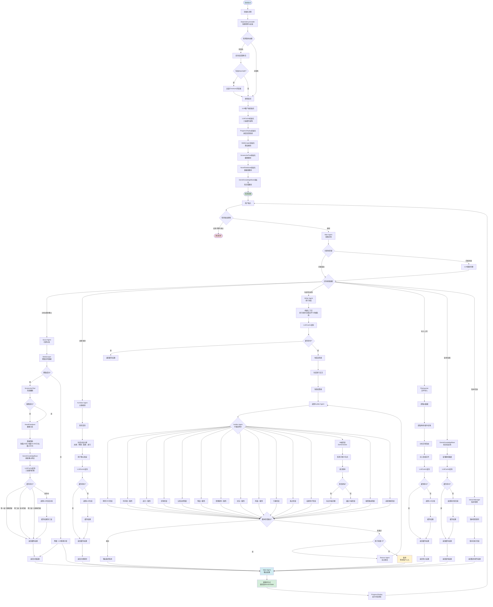

# 网络文学小说创作Agent系统

基于多Agent架构的智能网络小说创作系统，通过6个专业化子Agent协同工作，实现从市场分析到章节生成的完整创作流程。

## 目录

- [快速开始](#快速开始)
- [核心特性](#核心特性)
- [系统架构](#系统架构)
- [使用指南](#使用指南)
- [配置说明](#配置说明)
- [常见问题](#常见问题)
- [贡献指南](#贡献指南)

---

## 快速开始

### 环境要求

- Python 3.10+
- 至少一个LLM API密钥（DeepSeek/Kimi/GLM/OpenAI/Claude）

### 安装步骤

```bash
# 1. 克隆项目
git clone https://github.com/yourusername/novel_agent.git
cd novel_agent

# 2. 安装依赖（自动检测并安装缺失包）
pip install -r requirements.txt

# 3. 配置API密钥
# 编辑 config.py，设置 LLM_API_KEY
```

### 启动系统

```bash
python main.py
```

系统会自动检测并安装所有依赖（包括Playwright浏览器），首次启动可能需要几分钟。

---

## 核心特性

### 1. 多Agent协同架构

- **Main Agent**：主协调器，意图识别和SubAgent调度
- **Scout Agent**：扫榜分析师，分析爆火小说特征
- **Architect Agent**：架构师，分层大纲规划
- **Writer Agent**：写手，章节正文生成
- **Auditor Agent**：审计员，15维度一致性检查
- **Revisor Agent**：修订员，定点修复问题
- **Style Engineer**：文风工程师，风格学习和适配

### 2. 智能记忆系统

**三层记忆架构：**

- **热记忆**：当前会话上下文（内存）
- **温记忆**：跨会话核心信息（JSON持久化）
- **冷记忆**：历史摘要压缩存储（按章节索引）

**3个记忆点：**

- 记忆点1：用户约束条件（如"不要后宫"、"必须HE"）
- 记忆点2：用户修改记录（用于学习偏好）
- 记忆点3：工作进度（各步骤完成情况）

### 3. 真相文件体系

7个核心事实文件，确保创作一致性：

- 世界状态文件：世界观、规则、设定
- 角色矩阵文件：角色信息、关系、状态
- 时间线文件：事件时间顺序
- 伏笔钩子文件：伏笔埋设、触发、回收
- 物品流转文件：道具、装备流转记录
- 势力关系文件：势力分布、关系变化
- 剧情推进文件：主线、支线进展

### 4. 质量保障机制

**Quality Gate 6维度检查：**

1. 逻辑完整性
2. 信息完整性
3. 用户修改记忆
4. 格式与可读性
5. 专业性与可执行性
6. 一致性检查

**审计员15维度检查：**

- 角色OOC、时间线、战力、伏笔、认知边界
- 物品、世界规则、关系、风格、节奏
- 爽点、结尾钩子、AI味、剧情推进、读者体验

### 5. 实时数据爬取与分析

- **多平台爬虫**：支持番茄小说、起点中文网、七猫小说
- **智能意图识别**：自动检测用户是否需要爬取数据
- **数据持久化**：爬取的小说数据自动存入SQLite数据库
- **可视化截图**：基于Playwright的网页截图功能
- **进度反馈**：实时显示任务执行进度
- **知识库自动更新**：爆火小说的写法特征自动提取并更新

### 6. 全局LLM缓存优化

采用**三层缓存架构**，参考 MVR-cache（PKU-SDS-lab, 2026）和 GPTCache 方案，**全局提升整个系统的缓存命中率**：

```
第一层：精确匹配（MD5/BLAKE3哈希，O(1)查询）
    ↓ 未命中
第二层：语义匹配（embedding余弦相似度，阈值0.90）
    ↓ 未命中
第三层：关键词匹配（Jaccard相似度，阈值0.66）
    ↓ 未命中
调用LLM并缓存到三层
```

**全局集成架构：**

缓存已**深度集成到 LLMClient 底层**，所有 Agent 和模块的 LLM 调用都自动走同一个全局缓存：

- Scout Agent（扫榜分析）→ 自动走缓存
- Writer Agent（章节生成）→ 自动走缓存
- Auditor Agent（15维度审计）→ 自动走缓存
- Architect Agent（大纲规划）→ 自动走缓存
- Revisor Agent（定点修复）→ 自动走缓存
- Style Engineer（风格工程）→ 自动走缓存
- Main Agent（意图识别）→ 自动走缓存

所有模块共享**同一个缓存实例**，命中率是**整个系统级别的提升**。

**启用语义缓存（推荐）：**

```bash
pip install sentence-transformers jieba
```

**预期效果：**

- 精确匹配：命中率 10-20%（完全相同的prompt）
- 语义匹配：命中率 30-50%（语义相同但表述不同）
- 关键词匹配：命中率 10-20%（关键词重叠）
- **总命中率：50-90%**（相比原版提升 37-100%）

---

## 系统架构

### 目录结构

```
novel_agent/
├── main.py                    # 主程序入口
├── config.py                  # 配置管理
├── requirements.txt           # 依赖列表
├── README.md                  # 项目文档
├── .gitignore                 # Git忽略规则
├── LICENSE                    # MIT许可证
│
├── agents/                    # 6个专业化子Agent
│   ├── scout.py              # 扫榜分析师
│   ├── architect.py          # 架构师
│   ├── writer.py             # 写手
│   ├── auditor.py            # 审计员
│   ├── revisor.py            # 修订员
│   └── style_engineer.py     # 文风工程师
│
├── core/                      # 核心功能模块（29个）
│   ├── main_agent.py         # 主协调器
│   ├── session_state.py      # 会话状态管理
│   ├── truth_files.py        # 真相文件体系
│   ├── genre_knowledge.py    # 题材知识库
│   ├── memory_system.py      # 三层记忆系统
│   ├── user_profile.py       # 用户画像
│   ├── version_manager.py    # 版本管理
│   ├── file_importer.py      # 文件导入
│   ├── prompt_loader.py      # Prompt模板加载
│   ├── skill_library.py      # Skill存储框架
│   ├── skill_engine.py       # Skill自学习引擎
│   ├── quality_gate.py       # 质量门控
│   ├── foreshadow_tracker.py # 伏笔追踪
│   ├── character_manager.py  # 角色管理
│   ├── modification_tracker.py # 修改追踪
│   ├── checkpoint_manager.py # 检查点管理
│   ├── exporter.py           # 导出功能
│   ├── diagnostic_tool.py    # 诊断工具
│   ├── de_ai_checker.py      # 去AI味检查
│   ├── diversity_report.py   # 多样性报告
│   ├── batch_coordinator.py  # 批量生成协调
│   ├── ambiguity_detector.py # 模糊度检测
│   ├── expression_variants.py # 表达变体库
│   ├── meme_library.py       # 梗库
│   ├── structure_templates.py # 结构模板库
│   ├── trend_refresher.py    # 热点刷新器
│   ├── style_learner.py      # 风格学习器
│   ├── silent_modification_detector.py # 隐性修改检测
│   ├── dialogue_database.py  # 对话数据库
│   └── novel_database.py     # 小说数据库（爬取数据持久化）
│
├── utils/                     # 工具模块
│   ├── llm_client.py         # LLM客户端（多提供商支持）
│   ├── llm_cache.py          # LLM缓存机制
│   ├── web_scraper.py        # 网页爬虫（多平台支持）
│   ├── screenshot_tool.py    # 截图工具（Playwright）
│   ├── progress_display.py   # 进度反馈系统
│   └── dependency_installer.py # 依赖自动安装器
│
├── templates/                 # Prompt模板
│   ├── scout_prompt.md
│   ├── architect_prompt.md
│   ├── writer_prompt.md
│   ├── auditor_prompt.md
│   ├── revisor_prompt.md
│   └── style_engineer_prompt.md
│
└── data/                      # 数据目录
    ├── genres/               # 题材知识库（15种题材）
    ├── truth/                # 真相文件（运行时生成）
    ├── memory/               # 记忆系统数据
    ├── skills/               # Skill库
    ├── versions/             # 版本快照
    ├── checkpoints/          # 检查点
    ├── screenshots/          # 网页截图（Playwright生成）
    └── novels.db             # SQLite数据库（爬取的小说数据）
```

### 组件交互流程

```
┌─────────────┐
│   用户输入   │
└──────┬──────┘
       │
       ▼
┌─────────────────┐
│   Main Agent    │ ← 意图识别 + 流程控制
│  （主协调器）    │
└────────┬────────┘
         │
         ├─→ Scout Agent（扫榜分析）
         │      ↓
         ├─→ Architect Agent（大纲规划）
         │      ↓
         ├─→ Writer Agent（章节生成）
         │      ↓
         ├─→ Auditor Agent（质量审计）
         │      ↓
         ├─→ Revisor Agent（修订优化）
         │      ↓
         └─→ Style Engineer（文风学习）
                ↓
         ┌─────────────┐
         │ Quality Gate│ ← 6维度质量检查
         └──────┬──────┘
                │
                ▼
         ┌─────────────┐
         │   输出结果   │
         └─────────────┘
```

### 完整工作流程图



---

## 使用指南

### 基本命令

```
> help/帮助    # 显示帮助信息
> quit/退出    # 退出系统
> status/状态  # 显示当前状态
> crawl/爬取   # 爬取平台热门小说数据
> screenshot/截图 # 对指定URL截图
```

### 创作流程

```
1. 扫榜分析（Scout Agent）
   > 分析起点中文网玄幻题材热门作品

2. 大纲规划（Architect Agent）
   > 规划大纲

3. 章节生成（Writer Agent）
   > 生成第1章

4. 质量审计（Auditor Agent）
   自动进行15维度检查

5. 修订优化（Revisor Agent）
   如未通过，自动定点修复
```

### 高级功能

**1. 文件导入**

```
> 导入 d:/path/to/novel.docx
```

支持格式：.docx, .txt, .pdf, .epub

**2. 版本管理**

```
> 版本列表
> 回滚到 v1.0
> 比较 v1.0 v2.0
```

**3. 知识库查询**

```
> 查看玄幻题材知识库
```

**4. 自然语言退出**

支持多种表达方式：
- `quit`、`exit`、`q`、`退出`
- `拜拜`、`再见`、`结束聊天`
- `没事了`、`就这样`、`收工`

---

## 配置说明

### 核心配置文件

编辑 `config.py`：

```python
# LLM配置
LLM_PROVIDER = "deepseek"  # 提供商：deepseek/kimi/glm/openai/claude
LLM_MODEL = "deepseek-chat"  # 模型名称
LLM_API_KEY = "your-api-key"  # API密钥
LLM_BASE_URL = "https://api.deepseek.com/v1"  # API地址

# 温度参数（0-2）
LLM_TEMPERATURE = 0.7

# 最大输出token数
LLM_MAX_TOKENS = 4096

# 缓存配置
CACHE_MAX_SIZE = 2000  # 最大缓存条目数
CACHE_TTL_HOURS = 168  # 缓存过期时间（小时，7天）
CACHE_ENABLE_SEMANTIC = True  # 启用语义缓存
CACHE_ENABLE_KEYWORD = True  # 启用关键词缓存
CACHE_SEMANTIC_THRESHOLD = 0.90  # 语义相似度阈值
CACHE_KEYWORD_THRESHOLD = 0.66  # 关键词相似度阈值
```

### 目录结构配置

```python
# 数据目录
DATA_DIR = "data"

# 真相文件目录
TRUTH_DIR = "data/truth"

# 记忆系统目录
MEMORY_DIR = "data/memory"

# 版本快照目录
VERSIONS_DIR = "data/versions"

# 检查点目录
CHECKPOINTS_DIR = "data/checkpoints"

# 截图目录
SCREENSHOTS_DIR = "data/screenshots"

# 数据库文件
DATABASE_FILE = "data/novels.db"
```

---

## 常见问题

### 1. API连接失败

**问题**：启动时提示"连接失败"

**解决**：
1. 检查 `config.py` 中的 `LLM_API_KEY` 是否正确
2. 检查网络连接
3. 检查 `LLM_BASE_URL` 是否正确

### 2. max_tokens超限

**问题**：生成章节时提示"max_tokens超限"

**解决**：
1. 在 `config.py` 中增大 `LLM_MAX_TOKENS`
2. 或减小章节长度配置

### 3. 依赖安装失败

**问题**：自动安装依赖失败

**解决**：
```bash
# 手动安装
pip install -r requirements.txt

# 安装Playwright浏览器
python -m playwright install chromium
```

### 4. 内存不足

**问题**：系统运行缓慢或崩溃

**解决**：
1. 减少 `config.py` 中的 `MAX_CONVERSATION_HISTORY`
2. 定期清理 `data/memory/` 目录
3. 关闭其他占用内存的程序

### 5. 文件导入失败

**问题**：导入文件时报错

**解决**：
1. 检查文件路径是否正确
2. 检查文件格式是否支持（.docx, .txt, .pdf, .epub）
3. 安装必要的依赖：
   ```bash
   pip install python-docx PyPDF2 ebooklib
   ```

---

## 维护建议

### 1. 定期备份

```bash
# 备份数据目录
cp -r data/ data_backup_$(date +%Y%m%d)/

# 备份配置文件
cp config.py config_backup_$(date +%Y%m%d).py
```

### 2. 性能优化

- 定期清理 `data/screenshots/` 目录
- 定期清理 `data/versions/` 目录（保留最近10个版本）
- 定期清理 `data/memory/` 目录（保留最近30天的记忆）

### 3. 日志管理

系统日志保存在 `data/logs/` 目录，建议：
- 每周清理一次日志
- 保留最近30天的日志
- 定期备份重要日志

### 4. 更新维护

```bash
# 更新依赖
pip install --upgrade -r requirements.txt

# 更新Playwright浏览器
python -m playwright install chromium
```

---

## 贡献指南

### 提交Issue

1. 描述问题或建议
2. 提供复现步骤
3. 提供错误日志（如有）

### 提交Pull Request

1. Fork 项目
2. 创建分支：`git checkout -b feature/your-feature`
3. 提交更改：`git commit -m 'Add some feature'`
4. 推送分支：`git push origin feature/your-feature`
5. 提交 Pull Request

### 代码规范

- 遵循 PEP 8 规范
- 使用 4 空格缩进
- 添加必要的注释
- 编写单元测试

---

## 许可证

MIT License

---

## 联系方式

- Email: your-email@example.com
- GitHub: https://github.com/yourusername/novel_agent

---

## 致谢

感谢所有贡献者的支持！
