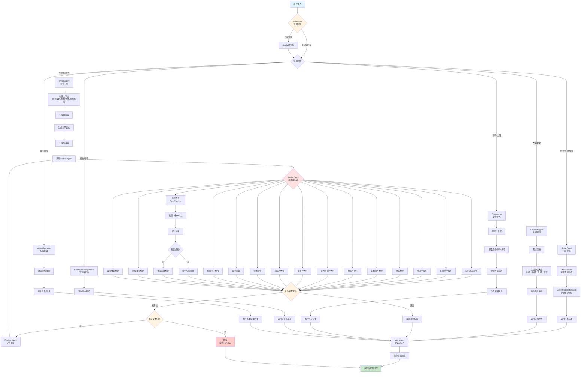

# 网络文学小说创作Agent系统

基于多Agent架构的智能网络小说创作系统，通过6个专业化子Agent协同工作，实现从市场分析到章节生成的完整创作流程。

## 目录

- [系统概述](#系统概述)
- [核心特性](#核心特性)
- [系统架构](#系统架构)
- [Agent协作流程](#agent协作流程)
- [流程管理](#流程管理)
- [快速开始](#快速开始)
- [使用指南](#使用指南)
- [配置说明](#配置说明)
- [功能模块](#功能模块)
- [常见问题](#常见问题)

---

## 系统概述

### 设计理念

系统采用"控制面与创作面分离"的多Agent架构，Main Agent统一调度6个专业子Agent。

**核心原则：**

- 循序渐进：每个步骤只输出当前阶段内容
- 用户至上：可随时修改前面的步骤，系统记忆并影响后续
- 主动判断：自动识别用户需求，路由到对应功能
- 质量保证：输出前必须经过Quality Gate检查

### 工作流程

```
用户需求 → 意图识别 → SubAgent路由 → 执行创作 → 质量检查 → 输出结果
```

**7步创作流程：**

1. 扫榜分析（Scout Agent）
2. 大纲规划（Architect Agent）
3. 章节生成（Writer Agent）
4. 连续性审计（Auditor Agent）
5. 修订优化（Revisor Agent）
6. 文风学习（Style Engineer）
7. 批量协调（Batch Coordinator）

---

## 核心特性

### 1. 多Agent协同架构

- **Main Agent**：主协调器，意图识别和SubAgent调度
- **Scout Agent**：扫榜分析师，分析爆火小说特征
- **Architect Agent**：架构师，分层大纲规划
- **Writer Agent**：写手，章节正文生成
- **Auditor Agent**：审计员，15维度一致性检查
- **Revisor Agent**：修订员，定点修复问题
- **Style Engineer**：文风工程师，风格学习和适配

### 2. 智能记忆系统

**三层记忆架构：**

- **热记忆**：当前会话上下文（内存）
- **温记忆**：跨会话核心信息（JSON持久化）
- **冷记忆**：历史摘要压缩存储（按章节索引）

**3个记忆点：**

- 记忆点1：用户约束条件（如"不要后宫"、"必须HE"）
- 记忆点2：用户修改记录（用于学习偏好）
- 记忆点3：工作进度（各步骤完成情况）

### 3. 真相文件体系

7个核心事实文件，确保创作一致性：

- 世界状态文件、角色矩阵文件、时间线文件、伏笔钩子文件、物品流转文件、势力关系文件、剧情推进文件

### 4. 质量保障机制

**Quality Gate 6维度检查：** 逻辑完整性、信息完整性、用户修改记忆、格式与可读性、专业性与可执行性、一致性检查

**审计员15维度检查：** 角色OOC、时间线、战力、伏笔、认知边界、物品、世界规则、关系、风格、节奏、爽点、结尾钩子、AI味、剧情推进、读者体验

### 5. 实时数据搜索与分析

- **智能网络搜索**：LLM驱动的网络搜索获取实时小说数据
- **多平台支持**：番茄小说、起点中文网、七猫小说
- **智能意图识别**：自动检测用户是否需要搜索数据
- **知识库自动更新**：爆火小说写法特征自动提取并更新到题材知识库

### 6. 进度反馈与流程管理

- **实时状态显示**：每个操作显示进度条和状态信息
- **Agent流程可视化**：清晰展示Agent调用顺序和执行状态
- **自定义流程**：用户可自定义Agent调用顺序
- **执行报告**：记录任务执行历史和耗时

### 7. 其他特性

- **多样性控制**：表达变体库、梗库、结构模板库、热点刷新器
- **版本管理**：断点恢复、版本比较和回滚、检查点管理
- **文件导入**：支持docx/pdf/txt/md格式，自动提取角色/事件/伏笔

---

## 系统架构

### 目录结构

```
novel_agent/
├── main.py                    # 主程序入口
├── config.py                  # 配置管理
├── requirements.txt           # 依赖列表
├── README.md                  # 项目文档
├── .gitignore                 # Git忽略规则
├── LICENSE                    # MIT许可证
│
├── agents/                    # 6个专业化子Agent
│   ├── scout.py              # 扫榜分析师
│   ├── architect.py          # 架构师
│   ├── writer.py             # 写手
│   ├── auditor.py            # 审计员
│   ├── revisor.py            # 修订员
│   └── style_engineer.py     # 文风工程师
│
├── core/                      # 核心功能模块
│   ├── main_agent.py         # 主协调器
│   ├── agent_flow_manager.py # Agent流程管理器
│   ├── session_state.py      # 会话状态管理
│   ├── truth_files.py        # 真相文件体系
│   ├── genre_knowledge.py    # 题材知识库
│   ├── memory_system.py      # 三层记忆系统
│   ├── quality_gate.py       # 质量门控
│   ├── foreshadow_tracker.py # 伏笔追踪
│   ├── character_manager.py  # 角色管理
│   ├── version_manager.py    # 版本管理
│   ├── batch_coordinator.py  # 批量生成协调
│   ├── de_ai_checker.py      # 去AI味检查
│   ├── file_importer.py      # 文件导入
│   ├── exporter.py           # 导出功能
│   └── ...                   # 其他支撑模块
│
├── utils/                     # 工具模块
│   ├── llm_client.py         # LLM客户端（多提供商支持）
│   ├── llm_cache.py          # LLM缓存机制
│   ├── web_search.py         # 网络搜索（LLM驱动）
│   ├── progress_display.py   # 进度反馈系统
│   └── dependency_installer.py # 依赖自动安装
│
├── templates/                 # Prompt模板
│   ├── scout_prompt.md
│   ├── architect_prompt.md
│   ├── writer_prompt.md
│   ├── auditor_prompt.md
│   ├── revisor_prompt.md
│   └── style_engineer_prompt.md
│
├── data/                      # 数据目录
│   ├── genres/               # 题材知识库（15种题材）
│   │   ├── 玄幻.json
│   │   ├── 仙侠.json
│   │   ├── 都市.json
│   │   ├── 历史.json
│   │   ├── 科幻.json
│   │   ├── 游戏.json
│   │   ├── 悬疑.json
│   │   ├── 言情.json
│   │   ├── 现言.json
│   │   ├── 古言.json
│   │   ├── 穿越.json
│   │   ├── 重生.json
│   │   ├── 系统流.json
│   │   ├── 宫斗.json
│   │   └── 宅斗.json
│   ├── truth/                # 真相文件（运行时生成）
│   ├── memory/               # 记忆系统数据
│   ├── skills/               # Skill库
│   ├── versions/             # 版本快照
│   └── checkpoints/          # 检查点
```

### 组件交互流程

```
┌─────────────┐
│   用户输入   │
└──────┬──────┘
       │
       ▼
┌─────────────────┐
│   Main Agent    │ ← 意图识别 + 流程控制
│  （主协调器）    │
└────────┬────────┘
         │
         ├─→ Scout Agent（扫榜分析）
         │      ↓
         ├─→ Architect Agent（大纲规划）
         │      ↓
         ├─→ Writer Agent（章节生成）
         │      ↓
         ├─→ Auditor Agent（质量审计）
         │      ↓
         ├─→ Revisor Agent（修订优化）
         │      ↓
         └─→ Style Engineer（文风学习）
                ↓
         ┌─────────────┐
         │ Quality Gate│ ← 6维度质量检查
         └──────┬──────┘
                │
                ▼
         ┌─────────────┐
         │   输出结果   │
         └─────────────┘
```

---

## Agent协作流程

### 意图识别与路由

```
用户输入 → Main Agent
  ↓
意图识别（关键词匹配 + LLM辅助）
  ↓
流程控制检查（防止跳步）
  ↓
路由到对应SubAgent
```

**路由规则：**

- 包含"分析"、"调研"、"爆火"、"热门" → **Scout Agent**
- 包含"大纲"、"规划"、"篇章" → **Architect Agent**
- 包含"生成"、"写"、"创作"、"第X章" → **Writer Agent**
- 包含"导入"、"上传"、"文件" → **FileImporter**
- 包含"查询"、"查看"、"知识库" → **GenreKnowledgeBase**
- 包含"版本"、"回滚"、"历史" → **VersionManager**

### 完整创作链路

```
Scout Agent（扫榜分析）
  ↓ 输出：热门小说列表、爆火特征分析
Architect Agent（大纲规划）
  ↓ 输出：总纲、卷纲、弧纲、章节规划
Writer Agent（章节生成）
  ↓ 输出：章节正文、自检表、结算表
Auditor Agent（质量审计）
  ↓ 输出：15维度审计报告
Revisor Agent（修订优化，如未通过）
  ↓ 输出：修订后的章节
Style Engineer（文风学习，可选）
  ↓ 输出：风格指南、文笔指纹
```

### 关键交互逻辑

#### Scout Agent → 知识库自动更新

```python
Scout Agent 搜索数据
  ↓
调用 WebSearch 获取实时数据
  ↓
调用 GenreKnowledgeBase 更新爆火特征
  ↓
返回分析结果给用户
```

#### Writer → Auditor → Revisor（质量保障链）

```python
Writer Agent 生成章节
  ↓
调用 Auditor Agent 进行15维度审计
  ↓
审计结果判断：
  ├─ 通过（overall_pass=True）→ 输出最终版本
  └─ 未通过（overall_pass=False）→ 调用 Revisor Agent
      ↓
      Revisor Agent 定点修复
      ↓
      重新调用 Auditor Agent（最多3轮）
      ↓
      3轮后仍未通过 → 暂停，等待用户介入
```

#### Style Engineer 独立工作流

```python
用户提供参考文本
  ↓
Style Engineer 分析文风
  ↓
提取文笔指纹（句式长度、对话占比、心理描写占比等）
  ↓
生成风格指南（JSON格式）
  ↓
后续 Writer Agent 生成时参考该风格指南
```

### 上下文传递

```python
Main Agent 准备上下文
  ↓
包含：
  - intent: 当前意图
  - current_step: 当前工作步骤
  - user_constraints: 用户约束（记忆点1）
  - user_modifications: 用户修改记录（记忆点2）
  - work_progress: 工作进度（记忆点3）
  - conversation_history: 最近10轮对话
  ↓
传递给SubAgent
  ↓
SubAgent基于上下文执行任务
```

### 完整工作流程图



---

## 流程管理

系统提供可视化的Agent调用流程管理，让用户清楚了解每个Agent的执行状态。

### 预定义流程

**1. novel_creation（小说创作流程）** - 6步完整流程

```
○ [1/6] 扫榜分析师 (scout) - 分析热门小说，提取爆火特征
○ [2/6] 架构师 (architect) - 规划小说大纲和章节结构
○ [3/6] 写手 (writer) - 生成章节正文
○ [4/6] 文风工程师 (style_engineer) - 分析和优化文风
○ [5/6] 审计员 (auditor) - 审核章节质量
○ [6/6] 修订员 (revisor) - 根据审核结果修订内容
```

**2. quick_analysis（快速分析流程）** - 1步快速流程

```
○ [1/1] 扫榜分析师 (scout) - 分析热门小说
```

**3. outline_only（大纲规划流程）** - 2步规划流程

```
○ [1/2] 扫榜分析师 (scout) - 分析热门小说
○ [2/2] 架构师 (architect) - 规划大纲
```

### 流程命令

```bash
flow              # 显示所有可用流程
flow list         # 列出所有流程
flow show <key>   # 查看流程详情
flow run <key>    # 执行流程
flow custom       # 交互式创建自定义流程
```

### 执行过程展示

```
============================================================
流程: 小说创作流程
============================================================

▶ [1/6] 扫榜分析师 (scout)
   分析热门小说，提取爆火特征

⏳ 正在调用: 扫榜分析师 (scout)
   任务: 分析热门小说，提取爆火特征

✓ 完成: 扫榜分析师

▶ [2/6] 架构师 (architect)
   规划小说大纲和章节结构

...

============================================================
流程执行完成
============================================================
总步骤: 6
成功: 6
失败: 0
```

### 自定义流程

```bash
flow custom    # 交互式创建自定义流程
```

**交互示例：**

```
创建自定义流程
流程标识符（英文，如 my_flow）: my_custom_flow
流程名称: 我的创作流程
流程描述: 只分析和生成，不审计

可用Agent:
  scout - 扫榜分析师
  architect - 架构师
  writer - 写手
  style_engineer - 文风工程师
  auditor - 审计员
  revisor - 修订员

请输入Agent调用顺序（用逗号分隔，如：scout,architect,writer）
Agent顺序: scout,writer

✓ 自定义流程 '我的创作流程' 创建成功
使用 'flow run my_custom_flow' 执行该流程
```

---

## 快速开始

### 环境要求

- Python 3.8+
- pip 包管理器
- LLM API密钥（支持Kimi/DeepSeek/GLM/OpenAI/Claude）

### 安装步骤

#### 1. 克隆项目

```bash
git clone <repository-url>
cd novel_agent
```

#### 2. 创建虚拟环境（推荐）

```bash
python -m venv .venv
source .venv/bin/activate  # Linux/Mac
.venv\Scripts\activate     # Windows
```

#### 3. 安装依赖

```bash
pip install -r requirements.txt
```

**主要依赖：**

- `openai`：OpenAI兼容API客户端
- `anthropic`：Claude API客户端
- `python-docx`：Word文档处理
- `pdfplumber`：PDF文档处理
- `ebooklib`：EPUB电子书生成
- `bm25s`：文本检索
- `jieba`：中文分词
- `requests`：HTTP请求（搜索模块）
- `beautifulsoup4`：HTML解析（搜索模块）

#### 4. 配置API密钥

编辑 `config.py` 文件，填入你的API密钥：

```python
LLM_PROVIDER = "deepseek"
LLM_MODEL = "deepseek-chat"
LLM_API_KEY = "your-api-key-here"  # 替换为你的API密钥
LLM_BASE_URL = "https://api.deepseek.com/v1"
LLM_TEMPERATURE = 0.75
LLM_MAX_TOKENS = 262144
```

**支持的LLM提供商：**

| 提供商   | LLM_PROVIDER | LLM_MODEL                  | LLM_BASE_URL                         |
| -------- | ------------ | -------------------------- | ------------------------------------ |
| Kimi     | kimi         | kimi-k2.5                  | https://api.moonshot.cn/v1           |
| DeepSeek | deepseek     | deepseek-chat              | https://api.deepseek.com/v1          |
| 智谱GLM  | glm          | glm-4                      | https://open.bigmodel.cn/api/paas/v4 |
| OpenAI   | openai       | gpt-4                      | https://api.openai.com/v1            |
| Claude   | claude       | claude-3-5-sonnet-20241022 | （无需base_url）                     |

#### 5. 运行测试

```bash
python -m unittest discover -s tests -p "test_*.py"
```

#### 6. 启动系统

```bash
python main.py
```

看到以下输出表示启动成功：

```
小说创作Agent系统
连接AI服务...
连接成功
初始化搜索模块...
初始化知识库...
初始化专业Agent...

功能：1.分析爆火小说 2.规划大纲 3.生成章节 4.导入文件 5.搜索平台数据 6.流程管理
命令：help-帮助 quit-退出 status-状态 search-搜索 flow-流程
>
```

---

## 使用指南

### 基本命令

```bash
help / h / 帮助 / ?    # 显示帮助信息
quit / exit / q / 退出  # 退出系统
status / 状态           # 显示当前状态
flow / 流程             # 显示/管理Agent调用流程
```

### 创作流程

#### 步骤1：扫榜分析

```
> 我想写一本玄幻小说，帮我分析一下当前爆火的玄幻小说
```

**系统响应：**

1. Scout Agent搜索当前热门玄幻小说
2. 分析3-5部对标作品的爆火特征
3. 输出结构化报告（热门作品列表、特征分析、共性特征、建议、推荐大纲框架）

#### 步骤2：大纲规划

```
> 根据刚才的分析，帮我规划一个玄幻大纲
```

**系统响应：**

1. Architect Agent进行需求澄清
2. 生成分层大纲（总纲→卷纲→弧纲→章节规划→伏笔规划）
3. 每层都需要用户确认

**Compass滚动规划：** 只详细规划前2卷+当前弧，后续卷保留骨架，每完成一卷自动展开下一卷

#### 步骤3：章节生成

```
> 开始生成第1章
```

**系统响应：**

1. Writer Agent生成自检表（本章涉及的角色、伏笔、爽点）
2. 用户确认自检表
3. 生成章节正文
4. 生成结算表（新增/变更的角色状态、事件、伏笔）
5. 交给Auditor Agent审计

#### 步骤4：质量审计

**系统自动执行：**

1. Auditor Agent从15个维度检查章节
2. 生成审计报告
3. 如有问题，交给Revisor Agent修订
4. 最多3轮审计-修订循环
5. 3轮后仍不通过则暂停，等待用户介入

#### 步骤5：批量生成

```
> 批量生成第1-10章
```

**系统响应：**

1. Batch Coordinator逐章生成
2. 每章生成后自动审计
3. 更新真相文件
4. 跨章一致性检查
5. 单章失败时只重写该章

### 高级功能

#### 导入已有小说

```
> 导入文件 path/to/novel.docx
```

系统提取元数据、角色、事件、伏笔，分析文笔指纹，自动注入真相文件体系。

#### 版本管理

```
> 查看版本历史
> 回滚到版本v2
> 对比版本v1和v2
```

#### 网络搜索

```
> 查看番茄小说男频游戏系统类的爆款
> 分析起点中文网玄幻题材热门作品
> 去番茄找女频仙侠爆火小说
```

系统自动识别平台、题材、受众，调用Scout Agent搜索并分析。

---

## 配置说明

### config.py 配置项

```python
# LLM配置
LLM_PROVIDER = "deepseek"          # LLM提供商
LLM_MODEL = "deepseek-chat"        # 模型名称
LLM_API_KEY = "your-api-key"       # API密钥
LLM_BASE_URL = "https://api.deepseek.com/v1"  # API地址
LLM_TEMPERATURE = 0.75             # 温度参数
LLM_MAX_TOKENS = 262144            # 最大token数

# Obsidian配置（可选）
OBSIDIAN_VAULT_PATH = ""           # Obsidian仓库路径

# 数据路径
DATA_DIR = "data"                  # 数据目录
GENRES_DIR = "data/genres"         # 题材知识库目录
TRUTH_DIR = "data/truth"           # 真相文件目录
MEMORY_DIR = "data/memory"         # 记忆系统目录
```

### 敏感文件

以下文件已加入 `.gitignore`，不会被提交到版本控制：

- `.env` - 环境变量
- `data/session_state.json` - 会话状态
- `data/memory/` - 记忆系统数据
- `data/truth/` - 真相文件
- `data/novels.db` - 小说数据库

---

## 功能模块

### 核心Agent

#### Scout Agent（扫榜分析师）

**文件：** `agents/scout.py`

**职责：** 根据用户提供的类型/题材，通过网络搜索获取热门作品数据，分析3-5部对标作品的爆火特征。

**分析维度：** 开篇钩子、爽点分布、人设套路、剧情模板、读者反馈

**输出：** 热门作品列表、特征分析、共性特征、针对性建议、推荐大纲框架

#### Architect Agent（架构师）

**文件：** `agents/architect.py`

**职责：** 需求澄清、分层大纲生成（总纲→卷纲→弧纲→章节规划）

**Compass滚动规划：** 只详细规划前2卷+当前弧，后续卷保留骨架

**伏笔生命周期：** 未埋设 → 已埋设 → 积累中 → 已触发 → 已回收

#### Writer Agent（写手）

**文件：** `agents/writer.py`

**职责：** 根据章节规划 + 真相文件 + 风格指南 + 题材禁忌，生成章节正文

**25条通用写作规则：** 人物塑造5条、去AI味5条、节奏控制5条、视角一致5条、其他5条

**输出：** 自检表 → 章节正文 → 结算表

#### Auditor Agent（审计员）

**文件：** `agents/auditor.py`

**职责：** 从15个维度检查章节内容一致性，集成DeAIChecker去AI化检测

**15个检查维度：** 角色OOC、时间线、战力、伏笔、认知边界、物品、世界规则、关系、风格、节奏、爽点、结尾钩子、AI味、剧情推进、读者体验

**AI味禁用清单（15种）：** "首先...其次...最后"、"值得一提的是"、"需要注意的是"、"综上所述"、"总的来说"、"然而"、"但是"、"因此"、"所以"、"显然"、"毫无疑问"、"不言而喻"、"众所周知"、"由此可见"、"一方面...另一方面"

#### Revisor Agent（修订员）

**文件：** `agents/revisor.py`

**职责：** 根据审计报告进行定点修复，只修改有问题的段落，不全章重写

**修订流程：** 审计报告 → 定位问题段落 → 定点修复 → 重新审计（最多3轮）

#### Style Engineer（文风工程师）

**文件：** `agents/style_engineer.py`

**职责：** 分析参考文本的写作风格，提取文笔指纹，生成风格指南

**文笔指纹：** 句式长度分布、对话占比、心理描写占比、环境描写占比、动作描写占比、常用词汇

**风格适配原则：** 70%保持原有风格，30%适应用户偏好

### 支撑模块

#### 真相文件体系（TruthFiles）

**文件：** `core/truth_files.py`

7个核心事实文件：世界状态、角色矩阵、时间线、伏笔钩子、物品流转、势力关系、剧情推进

#### 题材知识库（GenreKnowledgeBase）

**文件：** `core/genre_knowledge.py`

支持15种题材：玄幻、仙侠、都市、历史、科幻、游戏、悬疑、言情、现言、古言、穿越、重生、系统流、宫斗、宅斗

**自动更新机制：** 搜索热门小说后自动提取写法特征并更新知识库

#### 质量门控（QualityGate）

**文件：** `core/quality_gate.py`

6维度检查：逻辑完整性、信息完整性、用户修改记忆、格式与可读性、专业性与可执行性、一致性检查

#### 伏笔追踪系统（ForeshadowTracker）

**文件：** `core/foreshadow_tracker.py`

**伏笔生命周期：** 未埋设 → 已埋设 → 积累中 → 已触发 → 已回收 → 已放弃

**健康度检查：** 活跃伏笔不超过10个，超期未触发警告

#### 角色管理系统（CharacterManager）

**文件：** `core/character_manager.py`

维护角色状态快照，确保行为符合性格、对话符合风格、能力不突变、认知边界不越界

#### 版本管理系统（VersionManager）

**文件：** `core/version_manager.py`

版本快照保存、版本比较、版本回滚、混合版本生成

#### 批量生成协调器（BatchCoordinator）

**文件：** `core/batch_coordinator.py`

逐章生成 → 审计 → 更新真相文件 → 下一章，跨章一致性检查，单章失败时只重写该章

#### 其他模块

- **表达变体库**（`core/expression_variants.py`）：常见词汇的多种表达方式
- **梗库**（`core/meme_library.py`）：分类管理流行梗，新鲜度追踪
- **结构模板库**（`core/structure_templates.py`）：章节结构模板、结尾钩子模板
- **热点刷新器**（`core/trend_refresher.py`）：定期更新流行元素
- **风格学习器**（`core/style_learner.py`）：3个学习渠道，"轻微改动"原则
- **去AI味检查器**（`core/de_ai_checker.py`）：维护AI味禁用清单
- **文件导入模块**（`core/file_importer.py`）：支持docx/pdf/txt/md格式
- **导出功能**（`core/exporter.py`）：支持TXT/Markdown/EPUB格式
- **Skill存储框架**（`core/skill_library.py`）：Skill数据结构和存储
- **Skill自学习引擎**（`core/skill_engine.py`）：自动创建和改进Skill
- **用户画像**（`core/user_profile.py`）：记录用户偏好和写作习惯
- **会话状态管理**（`core/session_state.py`）：持久化工作进度和约束
- **检查点管理**（`core/checkpoint_manager.py`）：自动和手动检查点
- **修改追踪**（`core/modification_tracker.py`）：记录修改内容和影响范围
- **Agent流程管理器**（`core/agent_flow_manager.py`）：管理Agent调用流程和顺序

---

## 常见问题

### Q1: Scout Agent搜索失败后还能继续分析吗？

**A:** 可以。Scout Agent采用优雅降级策略：优先使用网络搜索获取实时数据，如果搜索失败，自动降级为LLM直接分析模式，保证流程不中断。

### Q2: Auditor Agent的15维度检查是并行还是串行？

**A:** 串行检查。每个维度的检查可能依赖前面的检查结果，串行检查便于追踪问题和生成详细报告。

### Q3: Revisor Agent 3轮修订后仍未通过怎么办？

**A:** 系统会暂停并等待用户介入，输出详细的问题摘要和修订建议。用户可以选择手动修改、降低质量标准、重新生成章节或跳过该章节。

### Q4: 知识库自动更新会影响正在进行的创作吗？

**A:** 不会。知识库采用热更新机制，每次查询前自动检测文件修改时间，正在进行的创作使用内存中的旧版本，新创作的内容会使用更新后的知识库。

### Q5: 如何查看Agent之间的交互日志？

**A:** 系统提供进度反馈系统（ProgressDisplay），实时显示每个Agent的执行状态、任务进度条和耗时，颜色编码：成功（绿色）、失败（红色）、警告（黄色）。

### Q6: 如何自定义Agent调用顺序？

**A:** 使用 `flow custom` 命令交互式创建自定义流程，选择需要的Agent并指定调用顺序。创建后使用 `flow run <flow_key>` 执行。

### Q7: 流程执行时Agent之间如何传递数据？

**A:** 流程管理器维护一个流程上下文（flow_context），每个Agent执行后将结果保存到上下文，后续Agent从上下文中获取前置步骤的输出作为输入。例如：Scout的输出传给Architect，Architect的输出传给Writer。

---

## 维护建议

### 日志管理

- 系统日志位于 `data/logs/` 目录
- 定期清理旧日志文件
- 重要操作前手动保存检查点

### 数据备份

- 定期备份 `data/` 目录
- 版本快照自动保存在 `data/versions/`
- 真相文件自动保存在 `data/truth/`

### 性能优化

- 调整 `LLM_MAX_TOKENS` 控制单次请求成本
- 使用 `LLM_CACHE_ENABLED=True` 启用缓存
- 批量生成时注意API调用频率限制

---

## 许可证

MIT License

---

## 贡献指南

欢迎提交Issue和Pull Request！

### 开发规范

- 所有代码文件必须包含详细注释
- 配置参数集中在 `config.py` 中
- 遵循Python PEP 8编码规范
- 提交前运行测试：`python -m unittest discover -s tests -p "test_*.py"`

### 添加新的Agent

1. 在 `agents/` 目录创建新的Agent文件
2. 实现Agent类，继承基类
3. 在 `main.py` 中注册Agent
4. 在 `core/agent_flow_manager.py` 中添加流程步骤
5. 创建对应的Prompt模板在 `templates/` 目录

### 添加新的题材

1. 在 `data/genres/` 目录创建新的JSON文件
2. 包含字段：name、tags、writing_style、plot_systems、character_templates、common_tropes、hot_topics
3. 系统会自动热加载新题材

---

## 联系方式

- 项目仓库：[GitHub Repository]
- 问题反馈：[Issues]
- 讨论交流：[Discussions]

---

**注意：** 本系统仅供学习和研究使用，生成的内容版权归用户所有。使用本系统时请遵守相关法律法规和平台规定。
